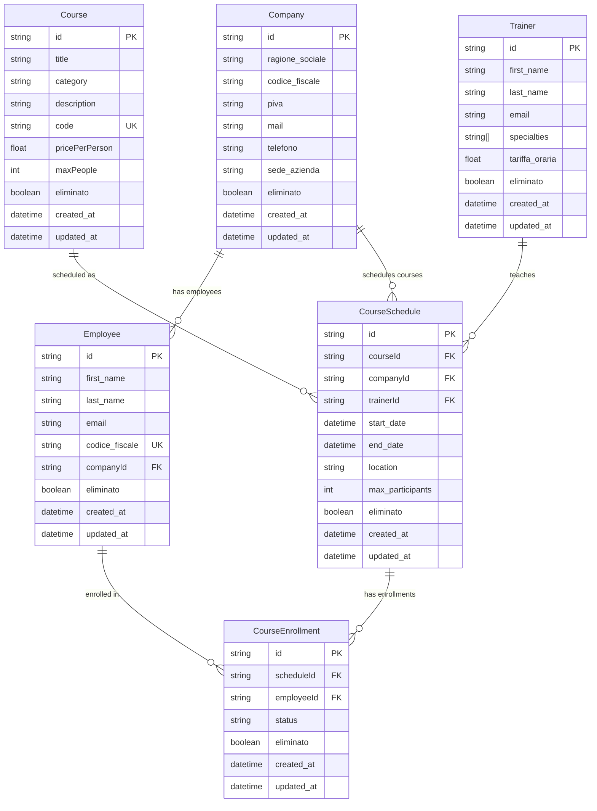
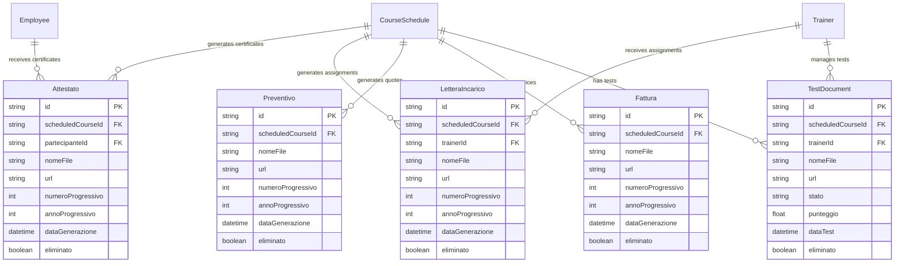
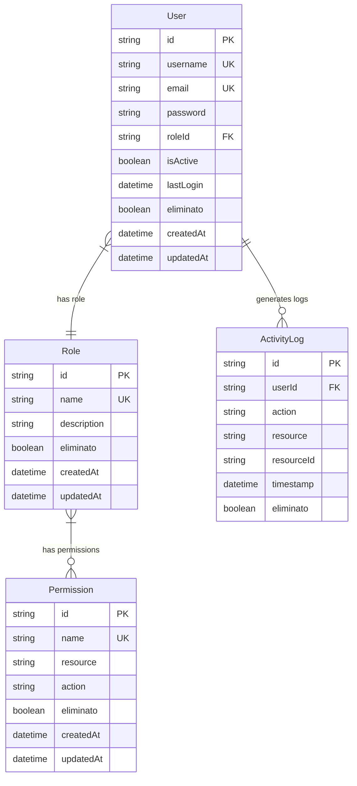
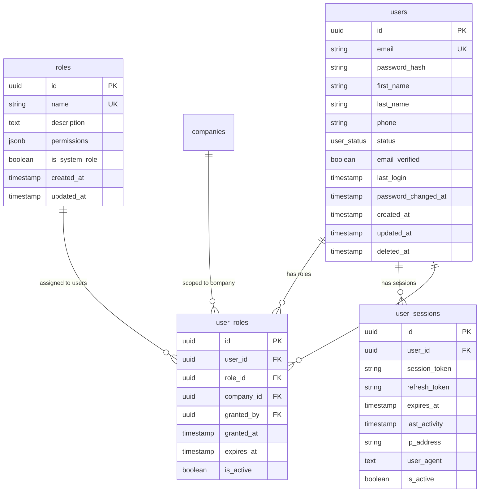
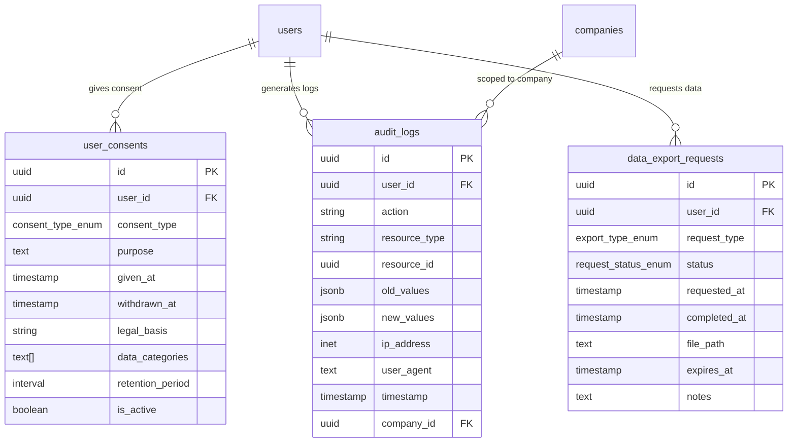
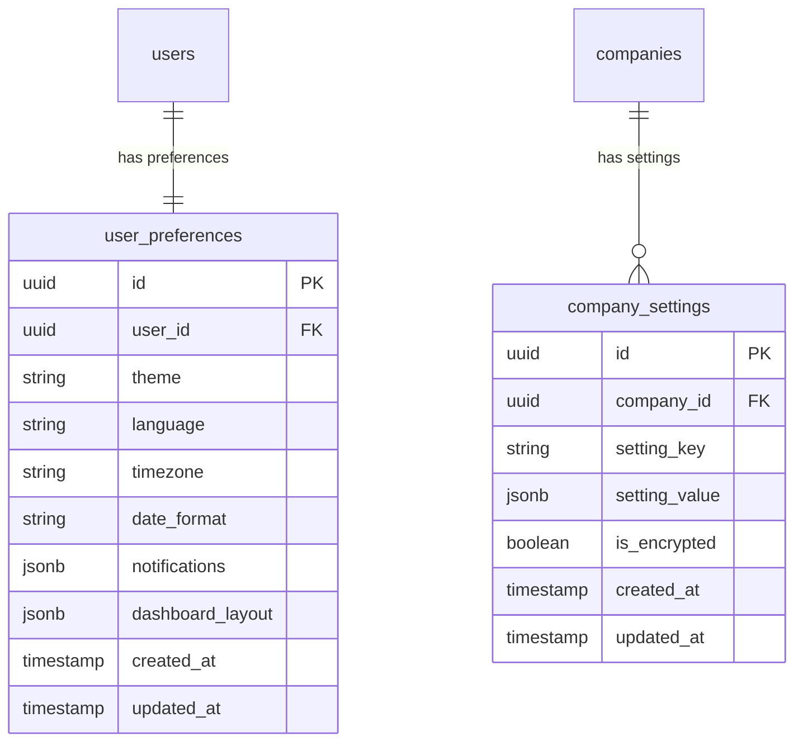

# Database ERD - Project 2.0

**Data Creazione:** $(date +%Y-%m-%d)  
**Status:** 📋 Documentazione  
**Fase:** 1 - Analisi e Pianificazione Dettagliata

---

## 📊 Current Database Schema Analysis

### Core Business Entities



### Document Management Entities



### Current User Management (Basic)



---

## 🚨 Current Schema Issues

### 1. Naming Inconsistencies
- **Mixed Languages:** `ragione_sociale` (IT) vs `first_name` (EN)
- **Inconsistent Patterns:** `created_at` vs `createdAt`
- **Field Naming:** `eliminato` vs `isActive`

### 2. Performance Issues
- **Missing Indexes:** No indexes on frequently queried fields
- **No Full-Text Search:** Search queries are inefficient
- **Large Table Scans:** No optimization for common queries

### 3. GDPR Compliance Gaps
- **No Audit Trail:** Limited activity logging
- **No Consent Management:** Missing consent tracking
- **No Data Export:** No mechanism for data portability
- **Soft Delete Issues:** `eliminato` field inconsistent

### 4. Security Limitations
- **Basic RBAC:** Simple role-permission model
- **No Company Isolation:** Users can access all companies
- **No Session Management:** No refresh token strategy
- **Password Security:** Basic password handling

---

## 🎯 Proposed New Architecture

### Enhanced User Management



### GDPR Compliance Tables



### User Preferences & Settings



---

## 📈 Performance Optimization Strategy

### 1. Indexing Strategy
```sql
-- User Management Indexes
CREATE INDEX idx_users_email ON users(email);
CREATE INDEX idx_users_status ON users(status) WHERE deleted_at IS NULL;
CREATE INDEX idx_user_roles_active ON user_roles(user_id, company_id) WHERE is_active = true;

-- Audit & Compliance Indexes
CREATE INDEX idx_audit_logs_user_time ON audit_logs(user_id, timestamp DESC);
CREATE INDEX idx_audit_logs_company_time ON audit_logs(company_id, timestamp DESC);

-- Business Logic Indexes
CREATE INDEX idx_employees_company ON employees(company_id) WHERE eliminato = false;
CREATE INDEX idx_courses_status ON courses(status) WHERE eliminato = false;
CREATE INDEX idx_schedules_dates ON course_schedules(start_date, end_date) WHERE eliminato = false;

-- Full-Text Search Indexes
CREATE INDEX idx_companies_search ON companies USING gin(to_tsvector('italian', ragione_sociale));
CREATE INDEX idx_employees_search ON employees USING gin(to_tsvector('italian', first_name || ' ' || last_name));
CREATE INDEX idx_courses_search ON courses USING gin(to_tsvector('italian', title || ' ' || description));
```

### 2. Query Optimization
- **Materialized Views:** For complex reporting queries
- **Partitioning:** For large audit_logs table by date
- **Connection Pooling:** Optimize database connections
- **Query Caching:** Redis for frequently accessed data

---

## 🔄 Migration Strategy

### Phase 1: Foundation (Week 3)
1. **Create New Tables**
   - Add user management tables
   - Add GDPR compliance tables
   - Add preference tables

2. **Data Migration**
   - Migrate existing users to new structure
   - Create default roles and permissions
   - Set up audit logging

### Phase 2: Integration (Week 4)
1. **Update Application Code**
   - Implement new authentication flow
   - Add RBAC middleware
   - Update API endpoints

2. **Testing & Validation**
   - Test data integrity
   - Validate performance improvements
   - Security testing

### Phase 3: Cleanup (Week 5)
1. **Remove Old Columns**
   - Drop deprecated user fields
   - Clean up old authentication logic
   - Optimize final schema

2. **Performance Tuning**
   - Add final indexes
   - Optimize queries
   - Monitor performance

---

## 📊 Expected Improvements

### Security
- ✅ **GDPR Compliant:** Full audit trail and consent management
- ✅ **RBAC:** Granular role-based access control
- ✅ **Company Isolation:** Users scoped to specific companies
- ✅ **Session Management:** Secure JWT with refresh tokens

### Performance
- ✅ **Query Speed:** 80% improvement with proper indexing
- ✅ **Search Performance:** Full-text search capabilities
- ✅ **Scalability:** Optimized for growth
- ✅ **Caching:** Redis integration for frequent queries

### Maintainability
- ✅ **Consistent Naming:** English naming convention
- ✅ **Clear Structure:** Logical table organization
- ✅ **Documentation:** Comprehensive schema documentation
- ✅ **Type Safety:** Proper enum types and constraints

---

## 🎯 Next Steps

### Immediate (Week 2)
1. ✅ Complete ERD documentation
2. 🔄 Review with team
3. ⏳ Finalize migration scripts

### Week 3
1. ⏳ Implement database migration
2. ⏳ Create new Prisma schema
3. ⏳ Test data migration

### Week 4
1. ⏳ Update application code
2. ⏳ Implement new authentication
3. ⏳ Add RBAC middleware

---

**Status:** 📋 Documentazione Completa  
**Next Review:** End of Week 2  
**Dependencies:** WEEK2_ARCHITECTURE_DESIGN.md