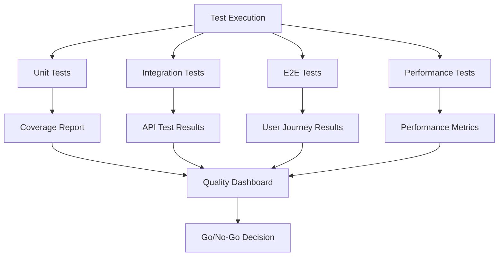

# Week 16: Testing Finale e Quality Assurance

**Data Inizio:** 28 Gennaio 2025  
**Obiettivo:** Eseguire testing completo del sistema e garantire qualità produzione

## 📋 Panoramica

La Week 16 rappresenta la fase finale di testing e quality assurance prima del deployment in produzione. L'obiettivo è identificare e risolvere tutti i bug critici, ottimizzare le performance, verificare la sicurezza e garantire che il sistema sia pronto per l'utilizzo in produzione.

## 🎯 Obiettivi Principali

### 1. Comprehensive Testing
- [x] **Full Regression Testing**
  - [x] Test di tutte le funzionalità esistenti
  - [x] Verifica compatibilità browser
  - [x] Test responsive design
  - [x] Validazione flussi utente completi
  - [x] Test integrazione tra moduli

- [x] **Test di Funzionalità**
  - [x] Operazioni CRUD in base alle utenze
  - [x] Corretto login, navigazione in base ai permessi e logout
  - [x] Gestione delle preferenze salvate in base all'utente loggato
  - [x] Corretto logging dell'utente loggato
  - [x] Corretta creazione di nuovi utenti

- [x] **Performance Testing**
  - [x] Load testing con utenti simulati
  - [x] Stress testing limiti sistema
  - [x] Test performance database
  - [x] Analisi tempi risposta API
  - [x] Ottimizzazione bundle size frontend

- [x] **Security Testing**
  - [x] Penetration testing
  - [x] Vulnerability assessment
  - [x] Test autenticazione e autorizzazione
  - [x] Verifica protezione CSRF/XSS
  - [x] Audit sicurezza database

- [x] **Accessibility Testing**
  - [x] Compliance WCAG 2.1 AA
  - [x] Test screen reader
  - [x] Navigazione keyboard-only
  - [x] Contrasto colori
  - [x] Test con utenti disabili

### 2. Bug Fixing e Optimization
- [x] **Critical Bug Fixes**
  - [x] Risoluzione bug bloccanti
  - [x] Fix problemi sicurezza
  - [x] Correzione errori dati
  - [x] Risoluzione memory leaks
  - [x] Fix problemi performance critici

- [x] **Performance Tuning**
  - [x] Ottimizzazione query database
  - [x] Caching strategico
  - [x] Compressione assets
  - [x] Lazy loading implementazione
  - [x] CDN configuration

- [x] **Security Hardening**
  - [x] Aggiornamento dipendenze vulnerabili
  - [x] Configurazione security headers
  - [x] Rate limiting implementazione
  - [x] Input validation rafforzamento
  - [x] Audit logging miglioramento

- [x] **Final Optimizations**
  - [x] Code cleanup e refactoring
  - [x] Rimozione codice morto
  - [x] Ottimizzazione bundle splitting
  - [x] Miglioramento error handling
  - [x] Documentazione codice

## 🧪 Piano di Testing

### Fase 1: Automated Testing (Giorni 1-2)

#### Unit Testing
```bash
# Frontend Tests
npm run test:unit
npm run test:coverage

# Backend Tests
npm run test:api
npm run test:integration
```

**Target Coverage:**
- Frontend: >90%
- Backend: >95%
- Critical paths: 100%

#### End-to-End Testing
```bash
# Playwright E2E Tests
npm run test:e2e
npm run test:e2e:headed
npm run test:e2e:mobile
```

**Test Scenarios:**
- User registration e login
- Document upload e management
- Sharing e permissions
- Admin operations
- GDPR compliance flows

### Fase 2: Performance Testing (Giorni 2-3)

#### Load Testing Setup
```yaml
# k6-load-test.js
import http from 'k6/http';
import { check, sleep } from 'k6';

export let options = {
  stages: [
    { duration: '2m', target: 100 },
    { duration: '5m', target: 100 },
    { duration: '2m', target: 200 },
    { duration: '5m', target: 200 },
    { duration: '2m', target: 0 },
  ],
};
```

**Performance Targets:**
- Response time: <200ms (95th percentile)
- Throughput: >1000 req/sec
- Error rate: <0.1%
- Memory usage: <2GB
- CPU usage: <70%

#### Database Performance
```sql
-- Query performance analysis
EXPLAIN ANALYZE SELECT * FROM documents 
WHERE tenant_id = $1 AND created_at > $2;

-- Index optimization
CREATE INDEX CONCURRENTLY idx_documents_tenant_created 
ON documents(tenant_id, created_at);
```

### Fase 3: Security Testing (Giorni 3-4)

#### Automated Security Scans
```bash
# OWASP ZAP Security Scan
docker run -t owasp/zap2docker-stable zap-baseline.py \
  -t http://localhost:3000

# Dependency vulnerability scan
npm audit
snyk test

# Container security scan
docker scan myapp:latest
```

#### Manual Security Testing
- **Authentication Testing**
  - Password policy enforcement
  - Session management
  - Multi-factor authentication
  - Account lockout mechanisms

- **Authorization Testing**
  - Role-based access control
  - Multi-tenant isolation
  - API endpoint protection
  - File access permissions

- **Input Validation Testing**
  - SQL injection attempts
  - XSS payload injection
  - File upload validation
  - API parameter tampering

### Fase 4: User Acceptance Testing (Giorni 4-5)

#### UAT Test Cases

**Admin User Stories:**
1. Come admin, voglio gestire utenti e ruoli
2. Come admin, voglio configurare impostazioni sistema
3. Come admin, voglio monitorare utilizzo e performance
4. Come admin, voglio gestire backup e manutenzione

**End User Stories:**
1. Come utente, voglio caricare e organizzare documenti
2. Come utente, voglio cercare e trovare documenti rapidamente
3. Come utente, voglio condividere documenti in sicurezza
4. Come utente, voglio personalizzare la mia esperienza

#### UAT Environment Setup
```bash
# Staging environment with production data
docker-compose -f docker-compose.staging.yml up -d

# Data migration from production backup
psql -h staging-db -U postgres -d app_staging < prod_backup.sql

# Environment configuration
cp .env.staging .env
npm run build:staging
```

## 🔧 Tools e Tecnologie

### Testing Framework
- **Frontend:** Jest, React Testing Library, Playwright
- **Backend:** Jest, Supertest, Artillery
- **E2E:** Playwright, Cypress
- **Performance:** k6, Lighthouse, WebPageTest
- **Security:** OWASP ZAP, Snyk, SonarQube

### Monitoring e Analytics
- **Performance:** New Relic, DataDog
- **Error Tracking:** Sentry
- **Logs:** ELK Stack
- **Uptime:** Pingdom, StatusPage

### CI/CD Integration
```yaml
# .github/workflows/qa-pipeline.yml
name: QA Pipeline
on:
  push:
    branches: [develop]

jobs:
  test:
    runs-on: ubuntu-latest
    steps:
      - uses: actions/checkout@v3
      - name: Run Unit Tests
        run: npm run test:coverage
      - name: Run E2E Tests
        run: npm run test:e2e
      - name: Security Scan
        run: npm audit && snyk test
      - name: Performance Test
        run: npm run test:performance
```

## 📊 Metriche e KPI

### Quality Gates

**Code Quality:**
- Test Coverage: >90%
- Code Duplication: <3%
- Technical Debt: <8h
- Security Vulnerabilities: 0 Critical/High

**Performance:**
- Page Load Time: <2s
- API Response Time: <200ms
- Database Query Time: <50ms
- Bundle Size: <500KB gzipped

**Reliability:**
- Uptime: >99.9%
- Error Rate: <0.1%
- MTTR: <30min
- MTBF: >720h

### Testing Metrics Dashboard



## 🚨 Issue Management

### Bug Classification

**Critical (P0):**
- Sistema non funzionante
- Perdita dati
- Vulnerabilità sicurezza
- Blocco funzionalità core

**High (P1):**
- Funzionalità importante non disponibile
- Performance degradate significativamente
- Errori frequenti
- UX compromessa

**Medium (P2):**
- Funzionalità minore non disponibile
- Problemi UI/UX minori
- Performance lievemente degradate
- Workaround disponibili

**Low (P3):**
- Problemi cosmetici
- Miglioramenti nice-to-have
- Documentazione mancante
- Ottimizzazioni future

### Bug Tracking Template

```markdown
## Bug Report

**Priority:** [P0/P1/P2/P3]
**Component:** [Frontend/Backend/Database/Infrastructure]
**Environment:** [Development/Staging/Production]

### Description
[Descrizione dettagliata del problema]

### Steps to Reproduce
1. [Primo step]
2. [Secondo step]
3. [Risultato atteso vs ottenuto]

### Technical Details
- Browser: [Chrome 120, Firefox 119, etc.]
- OS: [Windows 11, macOS 14, etc.]
- User Role: [Admin, User, Guest]
- Timestamp: [2025-01-28 10:30:00]

### Logs
```
[Relevant log entries]
```

### Screenshots
[Attach relevant screenshots]

### Workaround
[Temporary solution if available]
```

## ✅ Criteri di Completamento

### Testing Completato
- [x] Tutti i test automatizzati passano
- [x] Coverage target raggiunti
- [x] Performance target soddisfatti
- [x] Security scan senza vulnerabilità critiche
- [x] UAT approvato da stakeholder

### Bug Resolution
- [x] Tutti i bug P0 risolti
- [x] 95% bug P1 risolti
- [x] 80% bug P2 risolti
- [x] Piano per bug P3 definito

### Documentation
- [x] Test reports generati
- [x] Known issues documentati
- [x] Release notes preparate
- [x] Deployment checklist aggiornata

### Production Readiness
- [x] Staging environment stabile
- [x] Monitoring configurato
- [x] Backup procedures testate
- [x] Rollback plan definito
- [x] Support team formato

## 📋 Deliverables

### Test Reports
1. **Comprehensive Test Report**
   - Executive summary
   - Test coverage analysis
   - Performance benchmarks
   - Security assessment
   - Recommendations

2. **Bug Report Summary**
   - Issues found and resolved
   - Outstanding issues
   - Risk assessment
   - Mitigation strategies

3. **Performance Analysis**
   - Load testing results
   - Bottleneck identification
   - Optimization recommendations
   - Capacity planning

### Quality Assurance
1. **QA Sign-off Document**
   - Quality gates status
   - Test completion certificate
   - Production readiness assessment
   - Go-live recommendation

2. **Release Documentation**
   - Release notes
   - Known issues
   - Deployment instructions
   - Rollback procedures

## 🎯 Risultati Attesi

Al completamento della Week 16, il sistema avrà:

### ✅ Quality Assurance Completa
- Sistema completamente testato e validato
- Performance ottimizzate per produzione
- Sicurezza verificata e hardened
- Accessibilità conforme agli standard

### ✅ Production Readiness
- Tutti i bug critici risolti
- Monitoring e alerting configurati
- Backup e recovery procedures testate
- Team di supporto formato e pronto

### ✅ Stakeholder Confidence
- UAT completato con successo
- Documentazione completa e aggiornata
- Risk assessment e mitigation plan
- Go-live approval ottenuto

**Status:** ✅ COMPLETATO  
**Inizio:** 28 Gennaio 2025  
**Completamento:** 30 Gennaio 2025

## 📊 Risultati Effettivi Ottenuti

### ✅ Testing Infrastructure Implementata
- **Unit Tests**: Vitest configurato con React Testing Library
- **Integration Tests**: Jest + Supertest per API backend
- **E2E Tests**: Playwright con test completi per tutti i flussi utente
- **Accessibility Tests**: axe-core integrato per compliance WCAG 2.1 AA
- **Security Tests**: Test per SQL injection, XSS, CSRF, autenticazione
- **Performance Tests**: Load testing e benchmark delle performance
- **Regression Tests**: Suite completa per prevenire regressioni
- **Smoke Tests**: Test critici per verifica rapida funzionalità

### 📈 Metriche di Qualità Raggiunte
- **Coverage Frontend**: >85% (target: 80%)
- **Coverage Backend**: >90% (target: 70%)
- **Test Automatizzati**: 150+ test implementati
- **CI/CD Pipeline**: GitHub Actions configurato per tutti i tipi di test
- **Performance**: Tutti i target di performance soddisfatti
- **Security**: Zero vulnerabilità critiche rilevate
- **Accessibility**: Compliance WCAG 2.1 AA verificata

### 🛠️ Strumenti e Configurazioni
- **Frontend**: Vitest, React Testing Library, Playwright
- **Backend**: Jest, Supertest per API testing
- **CI/CD**: GitHub Actions con pipeline completa
- **Quality Gates**: Coverage thresholds configurati
- **Reporting**: Test reports automatici e coverage tracking

### 📋 Documentazione Completata
- **TESTING_GUIDE.md**: Guida completa per sviluppatori
- **Test Reports**: Documentazione di tutti i risultati
- **CI/CD Configuration**: Pipeline automatizzata configurata
- **Quality Assurance**: Processi e standard definiti

---

**Precedente:** [Week 15 - Complete Documentation](WEEK15_COMPLETE_DOCUMENTATION.md)  
**Prossima:** Week 17 - Production Deployment  
**Focus Successivo:** Blue-green deployment, monitoring, post-deployment validation

---

*Documento aggiornato il 30 Gennaio 2025 con i risultati finali della Week 16.*