# API Reference

**Versione:** 2.0  
**Data:** 29 Dicembre 2024  
**Base URL:** `http://localhost:4003/api`  
**Stato:** Post-Refactoring Sistema Unificato Person

## 📋 Panoramica

L'API del sistema è progettata seguendo i principi REST e fornisce accesso completo a tutte le funzionalità del sistema. Tutte le richieste devono essere autenticate tramite JWT token.

**Aggiornamenti Post-Refactoring:**
- ✅ Endpoint Person unificati (sostituiti User/Employee)
- ✅ Sistema PersonRole con RoleType enum
- ✅ PersonSession per gestione sessioni
- ✅ GDPR compliance completa con audit trail
- ✅ Soft delete standardizzato con deletedAt

## 🏗️ Architettura API

```mermaid
graph TD
    subgraph "🌐 Client Layer"
        WEB["Web App"]
        MOBILE["Mobile App"]
        API_CLIENT["API Client"]
    end
    
    subgraph "🔀 Proxy Layer"
        PROXY["Proxy Server<br/>:8888"]
    end
    
    subgraph "🔧 Backend Services"
        MAIN["Main Server<br/>:3001"]
        API["API Server<br/>:4001"]
        DOCS["Documents Server<br/>:4002"]
    end
    
    subgraph "💾 Data Layer"
        DB["PostgreSQL"]
        REDIS["Redis Cache"]
        FILES["File Storage"]
    end
    
    WEB --> PROXY
    MOBILE --> PROXY
    API_CLIENT --> PROXY
    
    PROXY --> MAIN
    PROXY --> API
    PROXY --> DOCS
    
    API --> DB
    API --> REDIS
    DOCS --> FILES
    
    style PROXY fill:#fff3e0
    style API fill:#e8f5e8
    style DB fill:#e1f5fe
```



## 🔐 Autenticazione

### JWT Token Structure

```typescript
interface JWTPayload {
  sub: string; // person_id
  email: string;
  personId: string;
  roles: string[]; // ['ADMIN', 'MANAGER', 'USER']
  sessionId: string;
  tenantId: string;
  permissions: string[];
  iat: number;
  exp: number;
  aud: string; // 'training-system'
  iss: string; // 'training-api'
}
```

### Headers Richiesti

```http
Authorization: Bearer <jwt_token>
Content-Type: application/json
X-Tenant-ID: <tenant_id>
```

### Codici di Stato

| Codice | Significato | Descrizione |
|--------|-------------|-------------|
| 200 | OK | Richiesta completata con successo |
| 201 | Created | Risorsa creata con successo |
| 400 | Bad Request | Dati della richiesta non validi |
| 401 | Unauthorized | Token di autenticazione mancante o non valido |
| 403 | Forbidden | Permessi insufficienti |
| 404 | Not Found | Risorsa non trovata |
| 409 | Conflict | Conflitto con lo stato attuale |
| 422 | Unprocessable Entity | Errori di validazione |
| 429 | Too Many Requests | Rate limit superato |
| 500 | Internal Server Error | Errore interno del server |

## 🔑 API Server (Port 4001)

### Authentication Endpoints

#### POST /auth/login
Autenticazione Person con credenziali unificate (Post-Refactoring).

**Request:**
```json
{
  "email": "person@example.com",
  "password": "password123",
  "tenantId": "tenant-uuid",
  "deviceInfo": {
    "userAgent": "Mozilla/5.0...",
    "ipAddress": "192.168.1.1"
  }
}
```

**Response:**
```json
{
  "success": true,
  "data": {
    "person": {
      "id": "person-uuid",
      "email": "person@example.com",
      "firstName": "Mario",
      "lastName": "Rossi",
      "roles": ["ADMIN", "MANAGER"],
      "tenantId": "tenant-uuid",
      "preferences": {
        "theme": "light",
        "language": "it"
      }
    },
    "tokens": {
      "accessToken": "jwt-access-token",
      "refreshToken": "jwt-refresh-token",
      "expiresIn": 3600
    },
    "session": {
      "id": "session-uuid",
      "expiresAt": "2024-12-30T10:00:00Z"
    }
  }
}
```

#### POST /auth/refresh
Rinnovo del token di accesso.

**Request:**
```json
{
  "refreshToken": "jwt-refresh-token"
}
```

**Response:**
```json
{
  "success": true,
  "data": {
    "accessToken": "new-jwt-access-token",
    "expiresIn": 3600
  }
}
```

#### POST /auth/logout
Logout dell'utente.

**Request:**
```json
{
  "refreshToken": "jwt-refresh-token"
}
```

**Response:**
```json
{
  "success": true,
  "message": "Logout successful"
}
```

### Person Management (Sistema Unificato)

#### GET /persons
Ottieni lista Person unificate con paginazione e GDPR compliance.

**Query Parameters:**
- `page` (number): Numero pagina (default: 1)
- `limit` (number): Elementi per pagina (default: 10, max: 100)
- `search` (string): Ricerca per nome o email
- `roleType` (string): Filtra per RoleType (ADMIN, MANAGER, EMPLOYEE, TRAINER)
- `status` (string): Filtra per stato (active, inactive)
- `includeDeleted` (boolean): Include soft deleted (solo ADMIN)

**Response:**
```json
{
  "success": true,
  "data": {
    "persons": [
      {
        "id": "person-uuid",
        "email": "person@example.com",
        "firstName": "Mario",
        "lastName": "Rossi",
        "roles": [
          {
            "roleType": "ADMIN",
            "assignedAt": "2025-01-27T10:00:00Z",
            "permissions": ["READ_ALL", "WRITE_ALL"]
          }
        ],
        "status": "active",
        "createdAt": "2025-01-27T10:00:00Z",
        "lastLoginAt": "2025-01-27T09:00:00Z",
        "deletedAt": null
      }
    ],
    "pagination": {
      "page": 1,
      "limit": 10,
      "total": 50,
      "totalPages": 5
    }
  }
}
```

#### GET /users/:id
Ottieni dettagli utente specifico.

**Response:**
```json
{
  "success": true,
  "data": {
    "user": {
      "id": "user-uuid",
      "email": "user@example.com",
      "firstName": "John",
      "lastName": "Doe",
      "role": "USER",
      "status": "active",
      "tenantId": "tenant-uuid",
      "preferences": {
        "theme": "light",
        "language": "it",
        "notifications": {
          "email": true,
          "push": false
        }
      },
      "createdAt": "2025-01-27T10:00:00Z",
      "updatedAt": "2025-01-27T10:00:00Z",
      "lastLoginAt": "2025-01-27T09:00:00Z"
    }
  }
}
```

#### POST /users
Crea nuovo utente.

**Request:**
```json
{
  "email": "newuser@example.com",
  "firstName": "Jane",
  "lastName": "Smith",
  "role": "USER",
  "password": "temporaryPassword123",
  "sendWelcomeEmail": true
}
```

**Response:**
```json
{
  "success": true,
  "data": {
    "user": {
      "id": "new-user-uuid",
      "email": "newuser@example.com",
      "firstName": "Jane",
      "lastName": "Smith",
      "role": "USER",
      "status": "active",
      "createdAt": "2025-01-27T10:00:00Z"
    }
  }
}
```

#### PUT /users/:id
Aggiorna utente esistente.

**Request:**
```json
{
  "firstName": "Jane Updated",
  "lastName": "Smith Updated",
  "role": "ADMIN",
  "status": "active"
}
```

#### DELETE /users/:id
Elimina utente (soft delete).

**Response:**
```json
{
  "success": true,
  "message": "User deleted successfully"
}
```

### User Preferences

#### GET /users/:id/preferences
Ottieni preferenze utente.

**Response:**
```json
{
  "success": true,
  "data": {
    "preferences": {
      "theme": "dark",
      "language": "en",
      "notifications": {
        "email": true,
        "push": false,
        "desktop": true
      },
      "dashboard": {
        "layout": "grid",
        "widgets": [
          {
            "id": "recent-documents",
            "position": { "x": 0, "y": 0, "w": 6, "h": 4 },
            "visible": true
          }
        ]
      }
    }
  }
}
```

#### PUT /users/:id/preferences
Aggiorna preferenze utente.

**Request:**
```json
{
  "theme": "dark",
  "language": "it",
  "notifications": {
    "email": false,
    "push": true
  }
}
```

### Tenant Management

#### GET /tenants
Ottieni lista tenant (solo admin).

**Response:**
```json
{
  "success": true,
  "data": {
    "tenants": [
      {
        "id": "tenant-uuid",
        "name": "Acme Corp",
        "domain": "acme.example.com",
        "status": "active",
        "plan": "premium",
        "userCount": 25,
        "createdAt": "2025-01-01T00:00:00Z"
      }
    ]
  }
}
```

#### POST /tenants
Crea nuovo tenant.

**Request:**
```json
{
  "name": "New Company",
  "domain": "newcompany.example.com",
  "plan": "basic",
  "adminUser": {
    "email": "admin@newcompany.com",
    "firstName": "Admin",
    "lastName": "User"
  }
}
```

### System Settings

#### GET /settings
Ottieni impostazioni di sistema.

**Response:**
```json
{
  "success": true,
  "data": {
    "settings": {
      "system": {
        "maintenanceMode": false,
        "registrationEnabled": true,
        "maxFileSize": 10485760,
        "allowedFileTypes": ["pdf", "doc", "docx", "txt"]
      },
      "features": {
        "documentSharing": true,
        "realTimeCollaboration": true,
        "advancedSearch": true
      },
      "security": {
        "passwordMinLength": 8,
        "sessionTimeout": 3600,
        "maxLoginAttempts": 5
      }
    }
  }
}
```

#### PUT /settings
Aggiorna impostazioni di sistema.

**Request:**
```json
{
  "system": {
    "maintenanceMode": true,
    "maxFileSize": 20971520
  },
  "features": {
    "documentSharing": false
  }
}
```

### GDPR & Privacy (Sistema Unificato)

#### GET /gdpr/data-export/:personId
Esporta dati Person completi per GDPR.

**Headers:**
- `Authorization: Bearer <jwt_token>`
- `X-GDPR-Request-Reason: data_portability`

**Response:**
```json
{
  "success": true,
  "data": {
    "exportId": "export-uuid",
    "status": "processing",
    "requestedAt": "2025-01-27T10:00:00Z",
    "estimatedCompletion": "2025-01-27T10:30:00Z",
    "personalData": {
      "id": "person-uuid",
      "email": "person@example.com",
      "firstName": "Mario",
      "lastName": "Rossi",
      "createdAt": "2024-01-01T00:00:00Z",
      "updatedAt": "2024-12-29T10:00:00Z"
    },
    "roles": [
      {
        "roleType": "ADMIN",
        "assignedAt": "2024-01-01T00:00:00Z",
        "permissions": ["READ_ALL", "WRITE_ALL"]
      }
    ],
    "sessions": [
      {
        "id": "session-uuid",
        "createdAt": "2024-12-29T09:00:00Z",
        "deviceInfo": "Mozilla/5.0...",
        "ipAddress": "192.168.1.1"
      }
    ],
    "auditTrail": [
      {
        "action": "LOGIN",
        "timestamp": "2024-12-29T09:00:00Z",
        "details": "Successful login"
      }
    ]
  }
}
```

#### POST /gdpr/data-deletion/:personId
Richiedi cancellazione dati Person.

**Request:**
```json
{
  "reason": "Person requested account deletion",
  "confirmEmail": "person@example.com",
  "gdprCompliant": true
}
```

#### GET /gdpr/consent/:personId
Ottieni stato consensi GDPR per Person.

**Response:**
```json
{
  "success": true,
  "data": {
    "consents": {
      "analytics": {
        "granted": true,
        "grantedAt": "2025-01-01T00:00:00Z"
      },
      "marketing": {
        "granted": false,
        "revokedAt": "2025-01-15T00:00:00Z"
      },
      "dataProcessing": {
        "granted": true,
        "grantedAt": "2025-01-01T00:00:00Z",
        "required": true
      }
    }
  }
}
```

### Audit Logs

#### GET /audit-logs
Ottieni log di audit.

**Query Parameters:**
- `page` (number): Numero pagina
- `limit` (number): Elementi per pagina
- `userId` (string): Filtra per utente
- `action` (string): Filtra per azione
- `startDate` (string): Data inizio (ISO 8601)
- `endDate` (string): Data fine (ISO 8601)

**Response:**
```json
{
  "success": true,
  "data": {
    "logs": [
      {
        "id": "log-uuid",
        "userId": "user-uuid",
        "action": "USER_LOGIN",
        "resource": "auth",
        "details": {
          "ip": "192.168.1.1",
          "userAgent": "Mozilla/5.0..."
        },
        "timestamp": "2025-01-27T10:00:00Z"
      }
    ],
    "pagination": {
      "page": 1,
      "limit": 10,
      "total": 100,
      "totalPages": 10
    }
  }
}
```

## 📁 Documents Server (Port 4002)

### Document Management

#### GET /documents
Ottieni lista documenti.

**Query Parameters:**
- `page` (number): Numero pagina
- `limit` (number): Elementi per pagina
- `search` (string): Ricerca nel contenuto
- `type` (string): Tipo documento
- `folderId` (string): ID cartella
- `sortBy` (string): Campo ordinamento
- `sortOrder` (string): Direzione ordinamento (asc, desc)

**Response:**
```json
{
  "success": true,
  "data": {
    "documents": [
      {
        "id": "doc-uuid",
        "name": "Important Document.pdf",
        "type": "pdf",
        "size": 1048576,
        "folderId": "folder-uuid",
        "createdBy": "user-uuid",
        "createdAt": "2025-01-27T10:00:00Z",
        "updatedAt": "2025-01-27T10:00:00Z",
        "tags": ["important", "contract"],
        "permissions": {
          "read": true,
          "write": true,
          "delete": false
        }
      }
    ],
    "pagination": {
      "page": 1,
      "limit": 10,
      "total": 50,
      "totalPages": 5
    }
  }
}
```

#### POST /documents/upload
Carica nuovo documento.

**Request (multipart/form-data):**
```
file: [binary file data]
name: "Document Name"
folderId: "folder-uuid"
tags: ["tag1", "tag2"]
description: "Document description"
```

**Response:**
```json
{
  "success": true,
  "data": {
    "document": {
      "id": "new-doc-uuid",
      "name": "Document Name.pdf",
      "type": "pdf",
      "size": 1048576,
      "url": "/documents/new-doc-uuid/download",
      "createdAt": "2025-01-27T10:00:00Z"
    }
  }
}
```

#### GET /documents/:id
Ottieni dettagli documento.

**Response:**
```json
{
  "success": true,
  "data": {
    "document": {
      "id": "doc-uuid",
      "name": "Important Document.pdf",
      "type": "pdf",
      "size": 1048576,
      "folderId": "folder-uuid",
      "description": "Important contract document",
      "tags": ["important", "contract"],
      "createdBy": "user-uuid",
      "createdAt": "2025-01-27T10:00:00Z",
      "updatedAt": "2025-01-27T10:00:00Z",
      "versions": [
        {
          "id": "version-uuid",
          "version": "1.0",
          "createdAt": "2025-01-27T10:00:00Z",
          "createdBy": "user-uuid"
        }
      ],
      "permissions": {
        "read": true,
        "write": true,
        "delete": false,
        "share": true
      }
    }
  }
}
```

#### GET /documents/:id/download
Scarica documento.

**Response:**
Binary file data con headers appropriati.

#### PUT /documents/:id
Aggiorna metadati documento.

**Request:**
```json
{
  "name": "Updated Document Name",
  "description": "Updated description",
  "tags": ["updated", "important"]
}
```

#### DELETE /documents/:id
Elimina documento.

**Response:**
```json
{
  "success": true,
  "message": "Document deleted successfully"
}
```

### Folder Management

#### GET /folders
Ottieni struttura cartelle.

**Response:**
```json
{
  "success": true,
  "data": {
    "folders": [
      {
        "id": "folder-uuid",
        "name": "Contracts",
        "parentId": null,
        "path": "/Contracts",
        "documentCount": 15,
        "subfolderCount": 3,
        "createdAt": "2025-01-01T00:00:00Z",
        "permissions": {
          "read": true,
          "write": true,
          "delete": false
        }
      }
    ]
  }
}
```

#### POST /folders
Crea nuova cartella.

**Request:**
```json
{
  "name": "New Folder",
  "parentId": "parent-folder-uuid",
  "description": "Folder description"
}
```

### Document Sharing

#### POST /documents/:id/share
Condividi documento.

**Request:**
```json
{
  "users": ["user1-uuid", "user2-uuid"],
  "permissions": ["read", "write"],
  "expiresAt": "2025-02-27T10:00:00Z",
  "message": "Please review this document"
}
```

#### GET /documents/:id/shares
Ottieni condivisioni documento.

**Response:**
```json
{
  "success": true,
  "data": {
    "shares": [
      {
        "id": "share-uuid",
        "userId": "user-uuid",
        "permissions": ["read"],
        "createdAt": "2025-01-27T10:00:00Z",
        "expiresAt": "2025-02-27T10:00:00Z",
        "user": {
          "firstName": "John",
          "lastName": "Doe",
          "email": "john@example.com"
        }
      }
    ]
  }
}
```

### Search

#### GET /search
Ricerca documenti avanzata.

**Query Parameters:**
- `q` (string): Query di ricerca
- `type` (string): Tipo documento
- `tags` (string[]): Tag da includere
- `dateFrom` (string): Data inizio
- `dateTo` (string): Data fine
- `size` (number): Dimensione file
- `author` (string): Autore documento

**Response:**
```json
{
  "success": true,
  "data": {
    "results": [
      {
        "document": {
          "id": "doc-uuid",
          "name": "Contract.pdf",
          "type": "pdf",
          "relevanceScore": 0.95
        },
        "highlights": [
          "This <mark>contract</mark> contains important terms..."
        ]
      }
    ],
    "total": 10,
    "searchTime": 0.05
  }
}
```

## 🏠 Main Server (Port 4001)

### Health Check

#### GET /health
Controllo stato del sistema.

**Response:**
```json
{
  "status": "ok",
  "timestamp": "2025-01-27T10:00:00Z",
  "uptime": 86400,
  "version": "1.0.0",
  "environment": "production",
  "checks": {
    "database": "ok",
    "redis": "ok",
    "memory": "ok",
    "disk": "ok"
  }
}
```

### System Information

#### GET /info
Informazioni di sistema.

**Response:**
```json
{
  "success": true,
  "data": {
    "system": {
      "name": "Document Management System",
      "version": "1.0.0",
      "environment": "production",
      "nodeVersion": "18.19.0",
      "uptime": 86400
    },
    "features": {
      "documentSharing": true,
      "realTimeCollaboration": true,
      "advancedSearch": true,
      "gdprCompliance": true
    }
  }
}
```

## 🔀 Proxy Server (Port 8888)

### Route Configuration

```typescript
// Proxy routing configuration
const routes = {
  '/api/auth/*': 'http://localhost:4001',
  '/api/users/*': 'http://localhost:4001',
  '/api/tenants/*': 'http://localhost:4001',
  '/api/settings/*': 'http://localhost:4001',
  '/api/gdpr/*': 'http://localhost:4001',
  '/api/audit-logs/*': 'http://localhost:4001',
  
  '/api/documents/*': 'http://localhost:4002',
  '/api/folders/*': 'http://localhost:4002',
  '/api/search/*': 'http://localhost:4002',
  
  '/api/health': 'http://localhost:3001',
  '/api/info': 'http://localhost:3001',
  
  '/*': 'http://localhost:5173' // Frontend dev server
};
```

## 📊 Rate Limiting

### Rate Limit Configuration

| Endpoint | Limite | Finestra | Descrizione |
|----------|--------|----------|-------------|
| `/auth/login` | 5 req | 15 min | Prevenzione brute force |
| `/auth/refresh` | 10 req | 1 min | Rinnovo token |
| `/documents/upload` | 10 req | 1 min | Upload documenti |
| `/search` | 30 req | 1 min | Ricerca documenti |
| `/api/*` | 100 req | 1 min | API generiche |

### Rate Limit Headers

```http
X-RateLimit-Limit: 100
X-RateLimit-Remaining: 95
X-RateLimit-Reset: 1643723400
Retry-After: 60
```

## 🔍 Error Handling

### Standard Error Response

```json
{
  "success": false,
  "error": {
    "code": "VALIDATION_ERROR",
    "message": "Validation failed",
    "details": [
      {
        "field": "email",
        "message": "Email is required"
      }
    ],
    "timestamp": "2025-01-27T10:00:00Z",
    "requestId": "req-uuid"
  }
}
```

### Error Codes

| Codice | Descrizione |
|--------|-------------|
| `VALIDATION_ERROR` | Errori di validazione input |
| `AUTHENTICATION_ERROR` | Errori di autenticazione |
| `AUTHORIZATION_ERROR` | Errori di autorizzazione |
| `NOT_FOUND` | Risorsa non trovata |
| `CONFLICT` | Conflitto con stato esistente |
| `RATE_LIMIT_EXCEEDED` | Rate limit superato |
| `INTERNAL_ERROR` | Errore interno del server |
| `MAINTENANCE_MODE` | Sistema in manutenzione |

## 📝 Logging

### Log Levels

- **ERROR**: Errori che richiedono attenzione immediata
- **WARN**: Situazioni anomale ma gestibili
- **INFO**: Informazioni generali sul funzionamento
- **DEBUG**: Informazioni dettagliate per debugging

### Log Format

```json
{
  "timestamp": "2025-01-27T10:00:00Z",
  "level": "INFO",
  "service": "api-server",
  "requestId": "req-uuid",
  "userId": "user-uuid",
  "tenantId": "tenant-uuid",
  "method": "POST",
  "url": "/api/users",
  "statusCode": 201,
  "responseTime": 150,
  "message": "User created successfully",
  "metadata": {
    "userAgent": "Mozilla/5.0...",
    "ip": "192.168.1.1"
  }
}
```

## 🧪 Testing

### Test Endpoints

#### GET /test/ping
Test di connettività.

**Response:**
```json
{
  "success": true,
  "message": "pong",
  "timestamp": "2025-01-27T10:00:00Z"
}
```

#### POST /test/echo
Test echo per debugging.

**Request:**
```json
{
  "message": "Hello World"
}
```

**Response:**
```json
{
  "success": true,
  "echo": {
    "message": "Hello World",
    "timestamp": "2025-01-27T10:00:00Z",
    "headers": {
      "user-agent": "...",
      "authorization": "Bearer ..."
    }
  }
}
```

## 🔄 Riepilogo Modifiche Post-Refactoring

### Endpoint Deprecati (NON utilizzare)
- ❌ `/api/users/*` → Sostituito con `/api/persons/*`
- ❌ `/api/employees/*` → Unificato in `/api/persons/*`
- ❌ `/api/auth/user-login` → Sostituito con `/api/auth/login`

### Nuovi Endpoint Unificati
- ✅ `/api/persons/*` - Gestione Person unificate
- ✅ `/api/persons/:id/roles` - Gestione PersonRole
- ✅ `/api/persons/:id/sessions` - Gestione PersonSession
- ✅ `/api/gdpr/export/:personId` - Export GDPR completo
- ✅ `/api/gdpr/audit/:personId` - Audit trail GDPR

### Modifiche Payload JWT
- ✅ `personId` invece di `userId`
- ✅ `roles` array invece di `role` singolo
- ✅ `sessionId` per tracking sessioni
- ✅ Claims `aud` e `iss` per sicurezza

### Soft Delete Standardizzato
- ✅ Tutti gli endpoint rispettano `deletedAt`
- ✅ Query parameter `includeDeleted` per ADMIN
- ✅ GDPR compliance automatica

---

**Precedente:** [Deployment Architecture](../architecture/deployment-architecture.md)  
**Prossimo:** [Database Schema](../database/schema.md)  
**Correlato:** [System Overview](../architecture/system-overview.md)

**Nota:** Questa documentazione riflette il sistema post-refactoring. Per segnalazioni o domande, contattare il team di sviluppo.