# Component Architecture

**Versione:** 1.0  
**Data:** 27 Gennaio 2025  
**Autore:** Team Development

## 📋 Panoramica

L'architettura frontend è basata su React 18 con TypeScript, seguendo principi di Atomic Design e Component-Driven Development. Il sistema è progettato per essere modulare, riutilizzabile e facilmente testabile.

## 🏗️ Struttura Generale

```
src/
├── components/           # Componenti riutilizzabili
│   ├── atoms/           # Componenti base
│   ├── molecules/       # Combinazioni di atoms
│   ├── organisms/       # Sezioni complesse
│   └── templates/       # Layout template
├── pages/               # Pagine applicazione
├── hooks/               # Custom hooks
├── contexts/            # React contexts
├── services/            # API services
├── utils/               # Utility functions
├── types/               # TypeScript types
└── assets/              # Static assets
```

## ⚛️ Atomic Design System

### Atoms (Componenti Base)

```mermaid
graph TD
    subgraph "🔹 Atoms"
        A1["Button"]
        A2["Input"]
        A3["Label"]
        A4["Icon"]
        A5["Badge"]
        A6["Avatar"]
        A7["Spinner"]
        A8["Tooltip"]
    end
    
    style A1 fill:#e3f2fd
    style A2 fill:#e3f2fd
    style A3 fill:#e3f2fd
    style A4 fill:#e3f2fd
```



#### Button Component
```typescript
// components/atoms/Button/Button.tsx
interface ButtonProps {
  variant: 'primary' | 'secondary' | 'danger' | 'ghost';
  size: 'sm' | 'md' | 'lg';
  disabled?: boolean;
  loading?: boolean;
  icon?: ReactNode;
  children: ReactNode;
  onClick?: () => void;
}

export const Button: FC<ButtonProps> = ({
  variant = 'primary',
  size = 'md',
  disabled = false,
  loading = false,
  icon,
  children,
  onClick
}) => {
  const baseClasses = 'inline-flex items-center justify-center font-medium rounded-lg transition-colors';
  const variantClasses = {
    primary: 'bg-blue-600 text-white hover:bg-blue-700',
    secondary: 'bg-gray-200 text-gray-900 hover:bg-gray-300',
    danger: 'bg-red-600 text-white hover:bg-red-700',
    ghost: 'text-gray-600 hover:bg-gray-100'
  };
  const sizeClasses = {
    sm: 'px-3 py-1.5 text-sm',
    md: 'px-4 py-2 text-base',
    lg: 'px-6 py-3 text-lg'
  };

  return (
    <button
      className={`${baseClasses} ${variantClasses[variant]} ${sizeClasses[size]}`}
      disabled={disabled || loading}
      onClick={onClick}
    >
      {loading && <Spinner size="sm" className="mr-2" />}
      {icon && <span className="mr-2">{icon}</span>}
      {children}
    </button>
  );
};
```

### Molecules (Combinazioni)


#### SearchBar Component
```typescript
// components/molecules/SearchBar/SearchBar.tsx
interface SearchBarProps {
  placeholder?: string;
  value: string;
  onChange: (value: string) => void;
  onSearch?: (value: string) => void;
  loading?: boolean;
  suggestions?: string[];
}

export const SearchBar: FC<SearchBarProps> = ({
  placeholder = "Cerca...",
  value,
  onChange,
  onSearch,
  loading = false,
  suggestions = []
}) => {
  const [showSuggestions, setShowSuggestions] = useState(false);

  const handleSubmit = (e: FormEvent) => {
    e.preventDefault();
    onSearch?.(value);
    setShowSuggestions(false);
  };

  return (
    <div className="relative">
      <form onSubmit={handleSubmit} className="flex">
        <Input
          type="text"
          placeholder={placeholder}
          value={value}
          onChange={(e) => onChange(e.target.value)}
          onFocus={() => setShowSuggestions(true)}
          className="rounded-r-none"
        />
        <Button
          type="submit"
          variant="primary"
          loading={loading}
          icon={<SearchIcon />}
          className="rounded-l-none"
        >
          Cerca
        </Button>
      </form>
      
      {showSuggestions && suggestions.length > 0 && (
        <SuggestionsList
          suggestions={suggestions}
          onSelect={(suggestion) => {
            onChange(suggestion);
            setShowSuggestions(false);
          }}
        />
      )}
    </div>
  );
};
```

### Organisms (Sezioni Complesse)

```mermaid
graph TD
    subgraph "🔶 Organisms"
        O1["Header"]
        O2["Sidebar"]
        O3["DataTable"]
        O4["Dashboard"]
        O5["UserProfile"]
        O6["CourseCard"]
        O7["EmployeeList"]
        O8["ScheduleCalendar"]
    end
    
    subgraph "🔸 Used Molecules"
        M1["SearchBar"]
        M2["Card"]
        M3["Modal"]
        M4["Pagination"]
    end
    
    O1 --> M1
    O3 --> M1
    O3 --> M4
    O6 --> M2
    
    style O1 fill:#fff3e0
    style O3 fill:#fff3e0
```



#### DataTable Component
```typescript
// components/organisms/DataTable/DataTable.tsx
interface Column<T> {
  key: keyof T;
  label: string;
  sortable?: boolean;
  render?: (value: any, row: T) => ReactNode;
  width?: string;
}

interface DataTableProps<T> {
  data: T[];
  columns: Column<T>[];
  loading?: boolean;
  pagination?: {
    current: number;
    total: number;
    pageSize: number;
    onChange: (page: number) => void;
  };
  searchable?: boolean;
  selectable?: boolean;
  onSelectionChange?: (selected: T[]) => void;
  actions?: {
    label: string;
    icon?: ReactNode;
    onClick: (row: T) => void;
    variant?: 'primary' | 'secondary' | 'danger';
  }[];
}

export const DataTable = <T extends Record<string, any>>({
  data,
  columns,
  loading = false,
  pagination,
  searchable = false,
  selectable = false,
  onSelectionChange,
  actions = []
}: DataTableProps<T>) => {
  const [searchTerm, setSearchTerm] = useState('');
  const [sortConfig, setSortConfig] = useState<{
    key: keyof T;
    direction: 'asc' | 'desc';
  } | null>(null);
  const [selectedRows, setSelectedRows] = useState<T[]>([]);

  // Filtering logic
  const filteredData = useMemo(() => {
    if (!searchTerm) return data;
    return data.filter(row =>
      Object.values(row).some(value =>
        String(value).toLowerCase().includes(searchTerm.toLowerCase())
      )
    );
  }, [data, searchTerm]);

  // Sorting logic
  const sortedData = useMemo(() => {
    if (!sortConfig) return filteredData;
    return [...filteredData].sort((a, b) => {
      const aValue = a[sortConfig.key];
      const bValue = b[sortConfig.key];
      if (aValue < bValue) return sortConfig.direction === 'asc' ? -1 : 1;
      if (aValue > bValue) return sortConfig.direction === 'asc' ? 1 : -1;
      return 0;
    });
  }, [filteredData, sortConfig]);

  const handleSort = (key: keyof T) => {
    setSortConfig(current => ({
      key,
      direction: current?.key === key && current.direction === 'asc' ? 'desc' : 'asc'
    }));
  };

  return (
    <div className="space-y-4">
      {searchable && (
        <SearchBar
          value={searchTerm}
          onChange={setSearchTerm}
          placeholder="Cerca nella tabella..."
        />
      )}
      
      <div className="overflow-x-auto">
        <table className="min-w-full divide-y divide-gray-200">
          <thead className="bg-gray-50">
            <tr>
              {selectable && (
                <th className="px-6 py-3 text-left">
                  <input
                    type="checkbox"
                    checked={selectedRows.length === sortedData.length}
                    onChange={(e) => {
                      const newSelection = e.target.checked ? sortedData : [];
                      setSelectedRows(newSelection);
                      onSelectionChange?.(newSelection);
                    }}
                  />
                </th>
              )}
              {columns.map(column => (
                <th
                  key={String(column.key)}
                  className="px-6 py-3 text-left text-xs font-medium text-gray-500 uppercase tracking-wider"
                  style={{ width: column.width }}
                >
                  {column.sortable ? (
                    <button
                      onClick={() => handleSort(column.key)}
                      className="flex items-center space-x-1 hover:text-gray-700"
                    >
                      <span>{column.label}</span>
                      <SortIcon direction={sortConfig?.key === column.key ? sortConfig.direction : null} />
                    </button>
                  ) : (
                    column.label
                  )}
                </th>
              ))}
              {actions.length > 0 && (
                <th className="px-6 py-3 text-right text-xs font-medium text-gray-500 uppercase tracking-wider">
                  Azioni
                </th>
              )}
            </tr>
          </thead>
          <tbody className="bg-white divide-y divide-gray-200">
            {loading ? (
              <tr>
                <td colSpan={columns.length + (selectable ? 1 : 0) + (actions.length > 0 ? 1 : 0)} className="px-6 py-4 text-center">
                  <Spinner size="lg" />
                </td>
              </tr>
            ) : sortedData.length === 0 ? (
              <tr>
                <td colSpan={columns.length + (selectable ? 1 : 0) + (actions.length > 0 ? 1 : 0)} className="px-6 py-4 text-center text-gray-500">
                  Nessun dato disponibile
                </td>
              </tr>
            ) : (
              sortedData.map((row, index) => (
                <tr key={index} className="hover:bg-gray-50">
                  {selectable && (
                    <td className="px-6 py-4">
                      <input
                        type="checkbox"
                        checked={selectedRows.includes(row)}
                        onChange={(e) => {
                          const newSelection = e.target.checked
                            ? [...selectedRows, row]
                            : selectedRows.filter(r => r !== row);
                          setSelectedRows(newSelection);
                          onSelectionChange?.(newSelection);
                        }}
                      />
                    </td>
                  )}
                  {columns.map(column => (
                    <td key={String(column.key)} className="px-6 py-4 whitespace-nowrap">
                      {column.render ? column.render(row[column.key], row) : String(row[column.key])}
                    </td>
                  ))}
                  {actions.length > 0 && (
                    <td className="px-6 py-4 whitespace-nowrap text-right text-sm font-medium">
                      <div className="flex justify-end space-x-2">
                        {actions.map((action, actionIndex) => (
                          <Button
                            key={actionIndex}
                            size="sm"
                            variant={action.variant || 'secondary'}
                            icon={action.icon}
                            onClick={() => action.onClick(row)}
                          >
                            {action.label}
                          </Button>
                        ))}
                      </div>
                    </td>
                  )}
                </tr>
              ))
            )}
          </tbody>
        </table>
      </div>
      
      {pagination && (
        <Pagination
          current={pagination.current}
          total={pagination.total}
          pageSize={pagination.pageSize}
          onChange={pagination.onChange}
        />
      )}
    </div>
  );
};
```

## 🎣 Custom Hooks Architecture

### Hook Categories

```mermaid
graph TD
    subgraph "🎣 Custom Hooks"
        H1["useApi"]
        H2["useAuth"]
        H3["useLocalStorage"]
        H4["useDebounce"]
        H5["usePermissions"]
        H6["usePagination"]
        H7["useTheme"]
        H8["useNotifications"]
    end
    
    subgraph "📊 State Management"
        S1["AuthContext"]
        S2["ThemeContext"]
        S3["NotificationContext"]
        S4["TenantContext"]
    end
    
    H2 --> S1
    H7 --> S2
    H8 --> S3
    H5 --> S4
    
    style H1 fill:#e8f5e8
    style H2 fill:#e8f5e8
    style S1 fill:#fff3e0
```



#### useApi Hook
```typescript
// hooks/useApi.ts
interface UseApiOptions<T> {
  immediate?: boolean;
  onSuccess?: (data: T) => void;
  onError?: (error: Error) => void;
  dependencies?: any[];
}

interface UseApiReturn<T> {
  data: T | null;
  loading: boolean;
  error: Error | null;
  execute: (...args: any[]) => Promise<T>;
  reset: () => void;
}

export const useApi = <T>(
  apiFunction: (...args: any[]) => Promise<T>,
  options: UseApiOptions<T> = {}
): UseApiReturn<T> => {
  const [data, setData] = useState<T | null>(null);
  const [loading, setLoading] = useState(false);
  const [error, setError] = useState<Error | null>(null);
  
  const { immediate = false, onSuccess, onError, dependencies = [] } = options;

  const execute = useCallback(async (...args: any[]) => {
    try {
      setLoading(true);
      setError(null);
      const result = await apiFunction(...args);
      setData(result);
      onSuccess?.(result);
      return result;
    } catch (err) {
      const error = err instanceof Error ? err : new Error('Unknown error');
      setError(error);
      onError?.(error);
      throw error;
    } finally {
      setLoading(false);
    }
  }, [apiFunction, onSuccess, onError]);

  const reset = useCallback(() => {
    setData(null);
    setError(null);
    setLoading(false);
  }, []);

  useEffect(() => {
    if (immediate) {
      execute();
    }
  }, [immediate, execute, ...dependencies]);

  return { data, loading, error, execute, reset };
};
```

## 🌐 Context Architecture

### Context Hierarchy


#### AuthContext Implementation
```typescript
// contexts/AuthContext.tsx
interface User {
  id: string;
  email: string;
  name: string;
  role: string;
  companyId: string;
  permissions: string[];
}

interface AuthContextType {
  user: User | null;
  loading: boolean;
  login: (identifier: string, password: string) => Promise<void>;
  logout: () => void;
  refreshToken: () => Promise<void>;
  hasPermission: (permission: string) => boolean;
  hasRole: (role: string) => boolean;
}

const AuthContext = createContext<AuthContextType | undefined>(undefined);

export const AuthProvider: FC<{ children: ReactNode }> = ({ children }) => {
  const [user, setUser] = useState<User | null>(null);
  const [loading, setLoading] = useState(true);

  const login = async (identifier: string, password: string) => {
  setLoading(true);
  try {
    const response = await authService.login({ identifier, password });
      setUser(response.user);
      // JWT tokens are handled by httpOnly cookies
    } catch (error) {
      throw error;
    } finally {
      setLoading(false);
    }
  };

  const logout = async () => {
    try {
      await authService.logout();
      setUser(null);
    } catch (error) {
      console.error('Logout error:', error);
    }
  };

  const refreshToken = async () => {
    try {
      const response = await authService.refreshToken();
      setUser(response.user);
    } catch (error) {
      setUser(null);
      throw error;
    }
  };

  const hasPermission = (permission: string): boolean => {
    return user?.permissions.includes(permission) || false;
  };

  const hasRole = (role: string): boolean => {
    return user?.role === role;
  };

  // Auto-refresh token on mount
  useEffect(() => {
    const initAuth = async () => {
      try {
        await refreshToken();
      } catch (error) {
        // User not authenticated
      } finally {
        setLoading(false);
      }
    };

    initAuth();
  }, []);

  // Setup token refresh interval
  useEffect(() => {
    if (user) {
      const interval = setInterval(() => {
        refreshToken().catch(() => {
          // Handle refresh failure
          logout();
        });
      }, 14 * 60 * 1000); // Refresh every 14 minutes

      return () => clearInterval(interval);
    }
  }, [user]);

  const value: AuthContextType = {
    user,
    loading,
    login,
    logout,
    refreshToken,
    hasPermission,
    hasRole
  };

  return (
    <AuthContext.Provider value={value}>
      {children}
    </AuthContext.Provider>
  );
};

export const useAuth = (): AuthContextType => {
  const context = useContext(AuthContext);
  if (context === undefined) {
    throw new Error('useAuth must be used within an AuthProvider');
  }
  return context;
};
```

## 📱 Page Architecture

### Page Structure

```mermaid
graph TD
    subgraph "📄 Page Components"
        P1["Dashboard"]
        P2["UsersPage"]
        P3["CoursesPage"]
        P4["EmployeesPage"]
        P5["SchedulesPage"]
        P6["SettingsPage"]
    end
    
    subgraph "🔶 Page Organisms"
        O1["UsersList"]
        O2["CourseCard"]
        O3["EmployeeTable"]
        O4["Calendar"]
        O5["SettingsPanel"]
    end
    
    P2 --> O1
    P3 --> O2
    P4 --> O3
    P5 --> O4
    P6 --> O5
    
    style P1 fill:#e1f5fe
    style P2 fill:#e1f5fe
```



#### Page Template
```typescript
// pages/UsersPage/UsersPage.tsx
interface UsersPageProps {}

export const UsersPage: FC<UsersPageProps> = () => {
  const { hasPermission } = useAuth();
  const [searchTerm, setSearchTerm] = useState('');
  const [filters, setFilters] = useState<UserFilters>({});
  const [pagination, setPagination] = useState({ page: 1, limit: 10 });

  const {
    data: users,
    loading,
    error,
    execute: fetchUsers
  } = useApi(userService.getUsers, {
    immediate: true,
    dependencies: [searchTerm, filters, pagination]
  });

  const handleSearch = (term: string) => {
    setSearchTerm(term);
    setPagination(prev => ({ ...prev, page: 1 }));
  };

  const handleFilterChange = (newFilters: UserFilters) => {
    setFilters(newFilters);
    setPagination(prev => ({ ...prev, page: 1 }));
  };

  if (!hasPermission('users.read')) {
    return <UnauthorizedPage />;
  }

  return (
    <PageLayout
      title="Gestione Utenti"
      breadcrumbs={[
        { label: 'Dashboard', href: '/' },
        { label: 'Utenti', href: '/users' }
      ]}
      actions={
        hasPermission('users.create') ? (
          <Button
            variant="primary"
            icon={<PlusIcon />}
            onClick={() => navigate('/users/new')}
          >
            Nuovo Utente
          </Button>
        ) : undefined
      }
    >
      <div className="space-y-6">
        <SearchAndFilters
          searchTerm={searchTerm}
          onSearchChange={handleSearch}
          filters={filters}
          onFiltersChange={handleFilterChange}
        />
        
        <UsersTable
          users={users?.data || []}
          loading={loading}
          pagination={{
            current: pagination.page,
            total: users?.total || 0,
            pageSize: pagination.limit,
            onChange: (page) => setPagination(prev => ({ ...prev, page }))
          }}
        />
      </div>
    </PageLayout>
  );
};
```

## 🎨 Styling Architecture

### CSS Architecture

```mermaid
graph TD
    subgraph "🎨 Styling Layers"
        L1["Tailwind Base"]
        L2["Design Tokens"]
        L3["Component Styles"]
        L4["Utility Classes"]
        L5["Theme Variables"]
    end
    
    L1 --> L2
    L2 --> L3
    L2 --> L5
    L3 --> L4
    
    style L1 fill:#e3f2fd
    style L2 fill:#f3e5f5
    style L3 fill:#e8f5e8
```



### Design Tokens
```typescript
// styles/tokens.ts
export const designTokens = {
  colors: {
    primary: {
      50: '#eff6ff',
      100: '#dbeafe',
      500: '#3b82f6',
      600: '#2563eb',
      900: '#1e3a8a'
    },
    gray: {
      50: '#f9fafb',
      100: '#f3f4f6',
      500: '#6b7280',
      900: '#111827'
    }
  },
  spacing: {
    xs: '0.5rem',
    sm: '1rem',
    md: '1.5rem',
    lg: '2rem',
    xl: '3rem'
  },
  typography: {
    fontFamily: {
      sans: ['Inter', 'system-ui', 'sans-serif'],
      mono: ['JetBrains Mono', 'monospace']
    },
    fontSize: {
      xs: '0.75rem',
      sm: '0.875rem',
      base: '1rem',
      lg: '1.125rem',
      xl: '1.25rem'
    }
  },
  borderRadius: {
    sm: '0.25rem',
    md: '0.375rem',
    lg: '0.5rem',
    xl: '0.75rem'
  },
  shadows: {
    sm: '0 1px 2px 0 rgb(0 0 0 / 0.05)',
    md: '0 4px 6px -1px rgb(0 0 0 / 0.1)',
    lg: '0 10px 15px -3px rgb(0 0 0 / 0.1)'
  }
};
```

## 🧪 Testing Architecture

### Testing Strategy

```mermaid
graph TD
    subgraph "🧪 Testing Pyramid"
        T1["Unit Tests<br/>(Jest + RTL)"]
        T2["Integration Tests<br/>(MSW)"]
        T3["E2E Tests<br/>(Playwright)"]
        T4["Visual Tests<br/>(Storybook)"]
    end
    
    T1 --> T2
    T2 --> T3
    T1 --> T4
    
    style T1 fill:#c8e6c9
    style T2 fill:#dcedc8
    style T3 fill:#f0f4c3
    style T4 fill:#fff9c4
```



### Component Test Example
```typescript
// components/atoms/Button/Button.test.tsx
import { render, screen, fireEvent } from '@testing-library/react';
import { Button } from './Button';

describe('Button Component', () => {
  it('renders with correct text', () => {
    render(<Button variant="primary">Click me</Button>);
    expect(screen.getByRole('button', { name: 'Click me' })).toBeInTheDocument();
  });

  it('calls onClick when clicked', () => {
    const handleClick = jest.fn();
    render(
      <Button variant="primary" onClick={handleClick}>
        Click me
      </Button>
    );
    
    fireEvent.click(screen.getByRole('button'));
    expect(handleClick).toHaveBeenCalledTimes(1);
  });

  it('shows loading state', () => {
    render(
      <Button variant="primary" loading>
        Click me
      </Button>
    );
    
    expect(screen.getByRole('button')).toBeDisabled();
    expect(screen.getByTestId('spinner')).toBeInTheDocument();
  });

  it('applies correct variant styles', () => {
    render(<Button variant="danger">Delete</Button>);
    const button = screen.getByRole('button');
    expect(button).toHaveClass('bg-red-600', 'text-white');
  });
});
```

---

**Precedente:** [Data Flow Diagrams](./data-flow-diagrams.md)  
**Prossimo:** [Deployment Architecture](./deployment-architecture.md)  
**Correlato:** [System Overview](./system-overview.md)