# Data Flow Diagrams

**Versione:** 1.0  
**Data:** 27 Gennaio 2025  
**Autore:** Team Development

## 📋 Panoramica

Questo documento descrive i flussi di dati principali all'interno del sistema, mostrando come le informazioni si muovono tra i diversi componenti dell'architettura.

## 🔄 Flussi Principali

### 1. Flusso Autenticazione e Autorizzazione

```mermaid
flowchart TD
    A["👤 User Login"] --> B["🌐 Frontend"]
    B --> C["🔀 Proxy Server"]
    C --> D["🔑 API Server"]
    D --> E["🗄️ Database"]
    E --> F{"Credenziali Valide?"}
    F -->|Sì| G["🎫 Genera JWT"]
    F -->|No| H["❌ Errore Auth"]
    G --> I["💾 Redis Session"]
    I --> J["🍪 Set Cookies"]
    J --> K["✅ Login Success"]
    H --> L["🚫 Login Failed"]
    
    style A fill:#e1f5fe
    style G fill:#c8e6c9
    style H fill:#ffcdd2
```

#### Dettaglio Flusso Autenticazione

1. **User Input**: Utente inserisce credenziali
2. **Frontend Validation**: Validazione client-side
3. **Proxy Routing**: Instradamento richiesta
4. **API Processing**: 
   - Validazione credenziali
   - Hash password check
   - Generazione JWT tokens
5. **Session Storage**: Salvataggio sessione in Redis
6. **Response**: Invio tokens sicuri al client

### 2. Flusso Operazioni CRUD

```mermaid
flowchart TD
    A["📱 User Action"] --> B["🌐 Frontend"]
    B --> C{"🔍 Auth Check"}
    C -->|Valid| D["🔀 Proxy Server"]
    C -->|Invalid| E["🔄 Refresh Token"]
    E --> D
    D --> F["🔑 API Server"]
    F --> G{"🛡️ Permission Check"}
    G -->|Authorized| H["💾 Redis Cache"]
    G -->|Denied| I["🚫 403 Forbidden"]
    H --> J{"📋 Cache Hit?"}
    J -->|Hit| K["⚡ Return Cached"]
    J -->|Miss| L["🗄️ Database Query"]
    L --> M["📝 Audit Log"]
    M --> N["💾 Update Cache"]
    N --> O["✅ Return Data"]
    K --> O
    O --> P["🌐 Frontend Update"]
    
    style A fill:#e1f5fe
    style G fill:#fff3e0
    style I fill:#ffcdd2
    style K fill:#c8e6c9
```

#### Dettaglio Flusso CRUD

1. **User Action**: Click, form submit, etc.
2. **Frontend Processing**: 
   - Validazione input
   - Preparazione richiesta
   - Loading state
3. **Authentication**: Verifica JWT validity
4. **Authorization**: Check permessi specifici
5. **Caching Layer**: Verifica cache Redis
6. **Database Operation**: Query/Update se necessario
7. **Audit Trail**: Log operazione per compliance
8. **Response**: Aggiornamento UI

### 3. Flusso Gestione Documenti

```mermaid
flowchart TD
    A["📄 Document Request"] --> B["🌐 Frontend"]
    B --> C["🔀 Proxy Server"]
    C --> D["📁 Documents Server"]
    D --> E{"🔍 File Exists?"}
    E -->|Yes| F{"🛡️ Access Check"}
    E -->|No| G["❌ 404 Not Found"]
    F -->|Authorized| H["📂 File System"]
    F -->|Denied| I["🚫 403 Forbidden"]
    H --> J{"📋 File Type?"}
    J -->|PDF| K["📄 Direct Serve"]
    J -->|Template| L["🔄 Google API"]
    J -->|Image| M["🖼️ Optimize & Serve"]
    L --> N["📝 Generate Document"]
    N --> O["💾 Cache Result"]
    O --> K
    K --> P["📤 Stream to Client"]
    M --> P
    
    style A fill:#e1f5fe
    style G fill:#ffcdd2
    style I fill:#ffcdd2
    style P fill:#c8e6c9
```

#### Dettaglio Flusso Documenti

1. **Document Request**: Richiesta file/documento
2. **Routing**: Proxy instrada a Documents Server
3. **File Validation**: Verifica esistenza file
4. **Access Control**: Check permessi accesso
5. **Processing**: 
   - PDF: Serve diretto
   - Template: Genera via Google API
   - Image: Ottimizza e serve
6. **Caching**: Cache risultati per performance
7. **Streaming**: Invio file al client

### 4. Flusso Multi-Tenant

```mermaid
flowchart TD
    A["👤 User Request"] --> B["🔑 JWT Token"]
    B --> C["🏢 Extract Company ID"]
    C --> D["🔀 Proxy Server"]
    D --> E["🔑 API Server"]
    E --> F["🛡️ Tenant Middleware"]
    F --> G{"🔍 Validate Tenant"}
    G -->|Valid| H["🗄️ Scoped Query"]
    G -->|Invalid| I["🚫 Tenant Error"]
    H --> J["📊 Company Data Only"]
    J --> K["✅ Response"]
    I --> L["❌ Access Denied"]
    
    style A fill:#e1f5fe
    style F fill:#fff3e0
    style I fill:#ffcdd2
    style J fill:#c8e6c9
```

#### Dettaglio Multi-Tenant

1. **User Request**: Richiesta con JWT
2. **Tenant Extraction**: Estrazione Company ID dal token
3. **Tenant Validation**: Verifica validità tenant
4. **Data Scoping**: Query limitate ai dati del tenant
5. **Response**: Solo dati autorizzati per il tenant

### 5. Flusso GDPR Compliance

```mermaid
flowchart TD
    A["🔒 GDPR Request"] --> B["🌐 Frontend"]
    B --> C["🔀 Proxy Server"]
    C --> D["🔑 API Server"]
    D --> E["🛡️ GDPR Middleware"]
    E --> F{"📋 Request Type?"}
    F -->|Export| G["📤 Data Export"]
    F -->|Delete| H["🗑️ Data Deletion"]
    F -->|Consent| I["✅ Consent Update"]
    G --> J["🗄️ Collect User Data"]
    H --> K["🗄️ Soft Delete"]
    I --> L["🗄️ Update Preferences"]
    J --> M["📄 Generate Report"]
    K --> N["📝 Audit Log"]
    L --> N
    M --> O["📧 Email Report"]
    N --> P["✅ Confirmation"]
    O --> P
    
    style A fill:#e1f5fe
    style E fill:#fff3e0
    style P fill:#c8e6c9
```

#### Dettaglio GDPR

1. **GDPR Request**: Richiesta diritto GDPR
2. **Request Processing**: Identificazione tipo richiesta
3. **Data Operations**:
   - **Export**: Raccolta e export dati utente
   - **Delete**: Soft delete con audit trail
   - **Consent**: Aggiornamento preferenze
4. **Audit Trail**: Log completo operazioni
5. **Notification**: Conferma all'utente

## 📊 Diagrammi di Stato

### Stato Sessione Utente

### Stato Documento

## 🔄 Flussi di Integrazione

### Integrazione Google APIs

### Flusso Backup Automatico

## 📈 Performance Considerations

### Caching Strategy

```mermaid
flowchart LR
    A["🌐 Request"] --> B{"💾 L1 Cache<br/>(Browser)"}
    B -->|Hit| C["⚡ Instant Response"]
    B -->|Miss| D{"💾 L2 Cache<br/>(Redis)"}
    D -->|Hit| E["🚀 Fast Response"]
    D -->|Miss| F["🗄️ Database"]
    F --> G["📊 Update Caches"]
    G --> H["📤 Response"]
    
    style C fill:#c8e6c9
    style E fill:#dcedc8
    style H fill:#f3e5f5
```

### Load Balancing

```mermaid
flowchart TD
    A["🌐 Client Requests"] --> B["⚖️ Load Balancer"]
    B --> C["🔀 Proxy 1"]
    B --> D["🔀 Proxy 2"]
    B --> E["🔀 Proxy N"]
    C --> F["🔑 API Cluster"]
    D --> F
    E --> F
    F --> G["🗄️ Database Cluster"]
    
    style B fill:#fff3e0
    style F fill:#e8f5e8
    style G fill:#e3f2fd
```

## 🔍 Monitoring e Observability

### Flusso Logging

```mermaid
flowchart TD
    A["📱 Application"] --> B["📝 Structured Logs"]
    B --> C["📊 Log Aggregator"]
    C --> D["🔍 Search Engine"]
    C --> E["📈 Metrics Store"]
    C --> F["🚨 Alerting"]
    D --> G["📊 Dashboard"]
    E --> G
    F --> H["📧 Notifications"]
    
    style A fill:#e1f5fe
    style G fill:#c8e6c9
    style H fill:#fff3e0
```

### Health Check Flow

## 🚨 Error Handling Flows

### Error Propagation

```mermaid
flowchart TD
    A["❌ Error Occurs"] --> B{"📍 Error Level"}
    B -->|Application| C["📝 Log Error"]
    B -->|System| D["🚨 Alert Admin"]
    B -->|Critical| E["📞 Page On-Call"]
    C --> F["🔄 Retry Logic"]
    D --> F
    E --> F
    F --> G{"🔄 Retry Success?"}
    G -->|Yes| H["✅ Continue"]
    G -->|No| I["🛑 Graceful Degradation"]
    I --> J["👤 User Notification"]
    
    style A fill:#ffcdd2
    style E fill:#ff8a80
    style H fill:#c8e6c9
```

---

**Precedente:** [System Overview](./system-overview.md)  
**Prossimo:** [Component Architecture](./component-architecture.md)  
**Correlato:** [Deployment Architecture](./deployment-architecture.md)