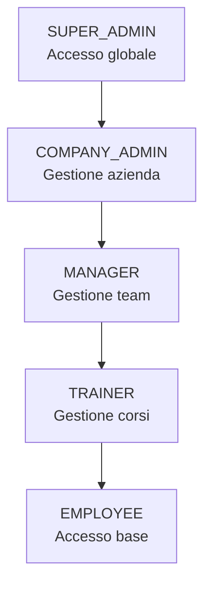
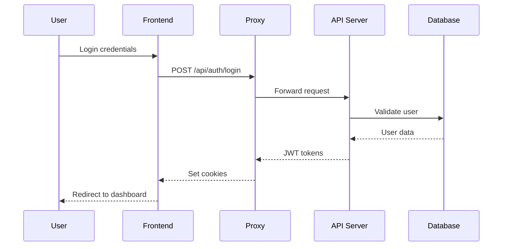
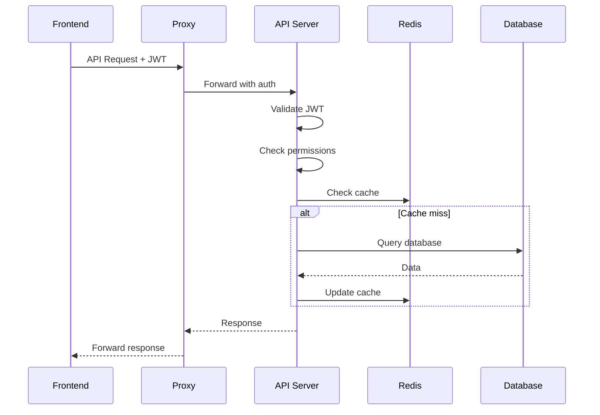

# System Architecture Overview

**Versione:** 1.0  
**Data:** 27 Gennaio 2025  
**Autore:** Team Development

## 📋 Panoramica Sistema

Il sistema è basato su un'architettura multi-server modulare che garantisce scalabilità, sicurezza e performance ottimali. L'architettura è progettata per supportare un ambiente multi-tenant con gestione avanzata di ruoli e permessi.

## 🏗️ Architettura Generale

### Componenti Principali

```mermaid
graph TB
    subgraph "Frontend Layer"
        UI["React Application<br/>Port: 5173"]
        SB["Storybook<br/>Port: 6006"]
    end
    
    subgraph "Backend Layer"
        MAIN["Main Server<br/>Port: 3001"]
        API["API Server<br/>Port: 4001"]
        DOCS["Documents Server<br/>Port: 4002"]
        PROXY["Proxy Server<br/>Port: 8888"]
    end
    
    subgraph "Data Layer"
        DB[("PostgreSQL<br/>Database")]
        REDIS[("Redis<br/>Cache")]
        FILES["File Storage"]
    end
    
    subgraph "External Services"
        GOOGLE["Google APIs"]
        EMAIL["Email Service"]
    end
    
    UI --> PROXY
    SB --> UI
    PROXY --> MAIN
    PROXY --> API
    PROXY --> DOCS
    
    MAIN --> DB
    API --> DB
    DOCS --> FILES
    
    API --> REDIS
    MAIN --> REDIS
    
    DOCS --> GOOGLE
    API --> EMAIL
```



## 🔧 Dettaglio Componenti

### Frontend Layer

#### React Application (Port 5173)
- **Tecnologie:** React 18, TypeScript, Vite
- **Stato:** Context API + Custom Hooks
- **Routing:** React Router v6 con lazy loading
- **Styling:** Tailwind CSS + CSS Modules
- **Build:** Vite con code splitting automatico

**Caratteristiche:**
- Single Page Application (SPA)
- Progressive Web App (PWA) ready
- Responsive design mobile-first
- Supporto multi-lingua (i18n)
- Theme system (Light/Dark/Auto)
- Lazy loading componenti

#### Storybook (Port 6006)
- **Scopo:** Documentazione e testing componenti
- **Integrazione:** Componenti isolati per sviluppo
- **Testing:** Visual regression testing

### Backend Layer

#### Main Server (Port 3001)
- **Ruolo:** Server principale e orchestratore
- **Tecnologie:** Node.js, Express
- **Responsabilità:**
  - Health check generale sistema
  - Coordinamento tra servizi
  - Gestione sessioni utente
  - Logging centralizzato

#### API Server (Port 4001)
- **Ruolo:** Core business logic e API REST
- **Tecnologie:** Node.js, Express, Prisma ORM
- **Responsabilità:**
  - Gestione entità business (Users, Companies, Courses, etc.)
  - Autenticazione e autorizzazione (JWT)
  - RBAC (Role-Based Access Control)
  - Multi-tenant isolation
  - GDPR compliance
  - Rate limiting e security

**Endpoints Principali:**
- `/api/auth/*` - Autenticazione
- `/api/users/*` - Gestione utenti
- `/api/companies/*` - Gestione aziende
- `/api/courses/*` - Gestione corsi
- `/api/employees/*` - Gestione dipendenti
- `/api/schedules/*` - Gestione pianificazioni
- `/api/gdpr/*` - Compliance GDPR

#### Documents Server (Port 4002)
- **Ruolo:** Gestione documenti e file
- **Tecnologie:** Node.js, Express, Google APIs
- **Responsabilità:**
  - Upload/download file
  - Generazione certificati PDF
  - Integrazione Google Drive/Docs
  - Template management
  - File compression e optimization
  - Backup automatico documenti

#### Proxy Server (Port 8888)
- **Ruolo:** Load balancer e reverse proxy
- **Tecnologie:** Node.js, Express
- **Responsabilità:**
  - Routing richieste ai server appropriati
  - Load balancing
  - SSL termination
  - Request/response caching
  - Security headers
  - Rate limiting globale

### Data Layer

#### PostgreSQL Database
- **Versione:** PostgreSQL 14+
- **ORM:** Prisma
- **Caratteristiche:**
  - Multi-tenant architecture
  - Soft delete implementation
  - Audit trail completo
  - Indici ottimizzati per performance
  - Backup automatico

**Schema Principale:**
- `users` - Utenti sistema
- `companies` - Aziende (tenant)
- `roles` - Ruoli e permessi
- `courses` - Corsi formativi
- `employees` - Dipendenti
- `schedules` - Pianificazioni
- `audit_logs` - Log attività
- `user_preferences` - Preferenze utente

#### Redis Cache
- **Versione:** Redis 6+
- **Utilizzo:**
  - Session storage
  - API response caching
  - Rate limiting counters
  - Real-time data caching
  - Job queue (future)

#### File Storage
- **Struttura:**
  ```
  uploads/
  ├── templates/     # Template documenti
  ├── attestati/     # Certificati generati
  ├── photos/        # Foto profilo
  └── documents/     # Documenti vari
  ```

## 🔐 Sicurezza e Autenticazione

### JWT Authentication
- **Access Token:** 15 minuti TTL
- **Refresh Token:** 7 giorni TTL
- **Algoritmo:** RS256 con chiavi asimmetriche
- **Storage:** HttpOnly cookies (secure)

### RBAC (Role-Based Access Control)


### Multi-Tenant Isolation
- **Livello Database:** Row-level security
- **Livello API:** Middleware tenant validation
- **Livello Frontend:** Context-based filtering

## 📊 Flusso Dati

### Autenticazione


### Operazioni CRUD


## 🚀 Performance e Scalabilità

### Frontend Optimizations
- **Code Splitting:** Route-based e component-based
- **Lazy Loading:** Componenti e immagini
- **Bundle Size:** Target < 1MB gzipped
- **Caching:** Service Worker per assets statici

### Backend Optimizations
- **Database:** Connection pooling, query optimization
- **Caching:** Multi-level caching strategy
- **Load Balancing:** Horizontal scaling ready
- **Monitoring:** Performance metrics e alerting

### Scalability Patterns
- **Microservices:** Server separati per responsabilità
- **Stateless:** Server stateless per horizontal scaling
- **Database:** Read replicas per scaling letture
- **CDN:** Assets statici su CDN

## 🔍 Monitoring e Logging

### Application Logging
- **Livelli:** ERROR, WARN, INFO, DEBUG
- **Formato:** Structured JSON logging
- **Destinazioni:** File + Console + External service

### Performance Monitoring
- **Metriche:** Response time, throughput, error rate
- **Health Checks:** Endpoint `/health` per ogni server
- **Alerting:** Soglie configurabili per metriche critiche

### Audit Trail
- **Scope:** Tutte le operazioni CRUD
- **Dati:** User, action, timestamp, changes
- **Retention:** Configurabile per compliance

## 🔄 Deployment Architecture

### Development
- **Frontend:** Vite dev server (HMR)
- **Backend:** Nodemon per auto-restart
- **Database:** Local PostgreSQL
- **Cache:** Local Redis

### Staging
- **Environment:** Mirror produzione
- **Database:** Staging database con dati test
- **Monitoring:** Completo come produzione
- **Testing:** Automated testing pipeline

### Production
- **Load Balancer:** Nginx/HAProxy
- **Application:** PM2 per process management
- **Database:** PostgreSQL cluster
- **Cache:** Redis cluster
- **Monitoring:** Comprehensive monitoring stack

## 📈 Metriche e KPI

### Performance Targets
- **Page Load:** < 2 secondi
- **API Response:** < 500ms (95th percentile)
- **Uptime:** 99.9%
- **Error Rate:** < 0.1%

### Business Metrics
- **User Engagement:** Session duration, page views
- **Feature Usage:** Adoption rate nuove funzionalità
- **System Health:** Server resources, database performance

---

**Prossimo:** [Data Flow Diagrams](./data-flow-diagrams.md)  
**Correlato:** [Component Architecture](./component-architecture.md)