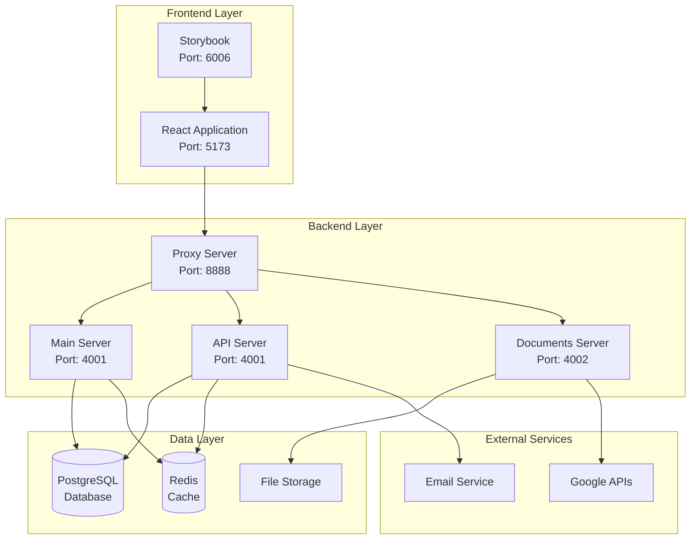
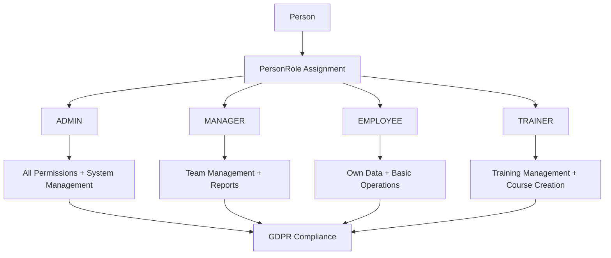
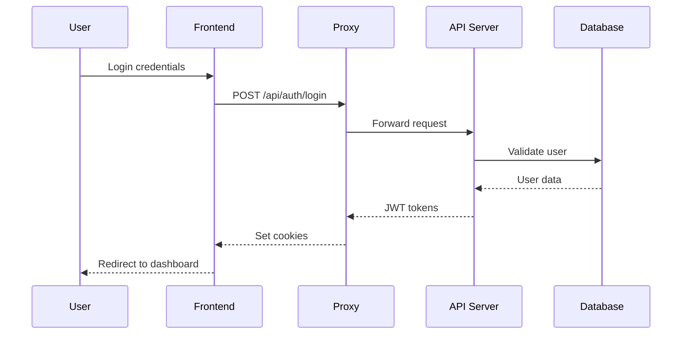
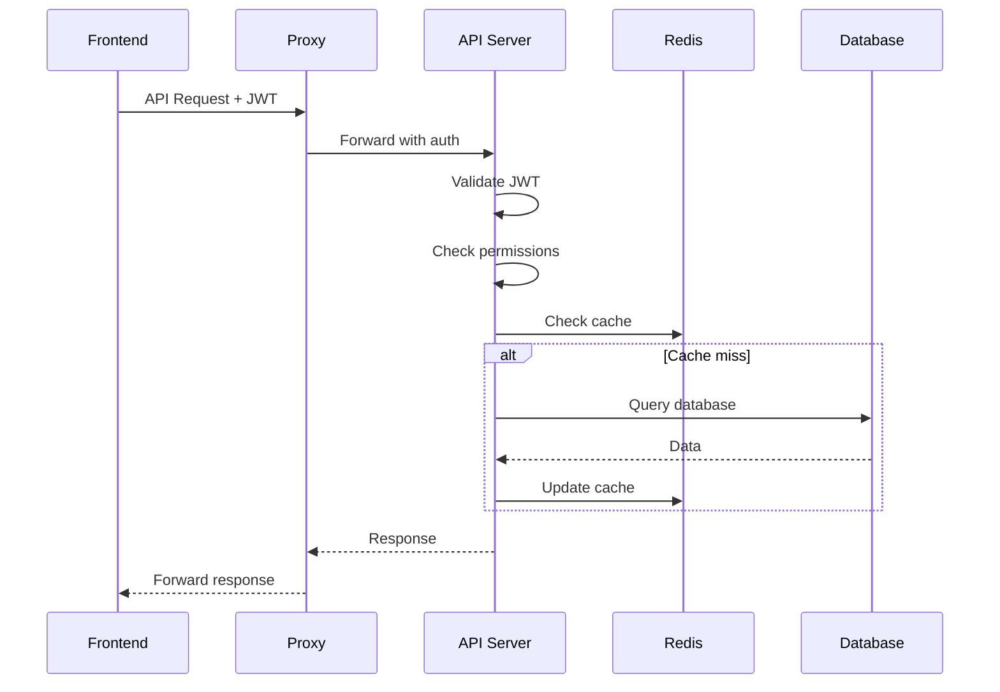

# 🏗️ Panoramica Architettura Sistema

**Versione**: 3.0 Post-Ottimizzazione Server  
**Data**: 27 Gennaio 2025  
**Sistema**: Architettura Ottimizzata GDPR-Compliant (Progetti 16-17)

## 📋 Panoramica Generale

Il sistema utilizza un'**architettura a tre server ottimizzata** progettata per garantire:
- **Modularità**: Middleware e configurazioni completamente separate
- **Performance**: Riduzione codice del 63% (API Server: 527→195 righe)
- **Sicurezza**: CORS centralizzato, rate limiting modulare, security headers
- **Manutenibilità**: Architettura completamente modulare e testabile
- **Resilienza**: Health check avanzati, graceful shutdown, lifecycle management
- **Conformità GDPR**: Sistema unificato `Person`, audit trail, soft delete

### 🎯 Ottimizzazioni Implementate (Progetti 16-17)

#### ✅ Proxy Server Ottimizzato (Progetto 16)
- **CORS Centralizzato**: Eliminazione di 6+ handler OPTIONS duplicati
- **Rate Limiting Modulare**: Con esenzioni configurabili per admin/health
- **Middleware Separati**: Security, logging, body parsing modulari
- **Health Check Avanzato**: `/healthz` con controlli multipli (DB, API, memoria)
- **Graceful Shutdown**: Gestione unificata SIGTERM/SIGINT con cleanup
- **Testing Integrato**: Supertest, ESLint, Prettier per qualità codice

#### ✅ API Server Ottimizzato (Progetto 17)
- **Riduzione Codice Drastica**: Da 527 a 195 righe (-63%)
- **ServiceLifecycleManager**: Gestione ordinata inizializzazione servizi
- **MiddlewareManager**: Middleware centralizzati e riutilizzabili
- **APIVersionManager**: Supporto versioning API (v1/v2)
- **Performance Monitoring**: Condizionale e ottimizzato (bug risolto)
- **Input Validation**: Centralizzata con Joi/Zod per sicurezza

## 🏗️ Architettura Generale

### Componenti Principali



## 🔧 Dettaglio Componenti Ottimizzati

### Frontend Layer

#### React Application (Port 5173)
- **Tecnologie:** React 18, TypeScript, Vite
- **Stato:** Context API + Custom Hooks
- **Routing:** React Router v6 con lazy loading
- **Styling:** Tailwind CSS + CSS Modules
- **Build:** Vite con code splitting automatico
- **Template System:** GDPREntityTemplate unificato

**Caratteristiche:**
- Single Page Application (SPA)
- Progressive Web App (PWA) ready
- Responsive design mobile-first
- Supporto multi-lingua (i18n)
- Theme system (Light/Dark/Auto)
- Lazy loading componenti
- Template GDPR-compliant unificato per tutte le entità
- Componenti UI moderni riutilizzabili (ViewModeToggle, AddEntityDropdown, FilterPanel, ColumnSelector, BatchEditButton)
- **NUOVO:** Integrazione con health check ottimizzati

#### Storybook (Port 6006)
- **Scopo:** Documentazione e testing componenti
- **Integrazione:** Componenti isolati per sviluppo
- **Testing:** Visual regression testing

### Backend Layer Ottimizzato

#### Proxy Server (Port 8888) - OTTIMIZZATO (Progetto 16)
- **Ruolo:** Load balancer e reverse proxy ottimizzato
- **Tecnologie:** Node.js, Express modulare
- **Responsabilità:**
  - **CORS Centralizzato:** Configurazione unificata per tutti gli endpoint
  - **Rate Limiting Modulare:** Con esenzioni per admin e health check
  - **Routing Intelligente:** Distribuzione richieste tra API e Documents Server
  - **Security Headers:** Helmet.js integrato per sicurezza avanzata
  - **Health Check Avanzato:** `/healthz` con controlli multipli (DB, API, memoria)
  - **Graceful Shutdown:** Gestione pulita SIGTERM/SIGINT

**Struttura Modulare:**
```
proxy/
├── middleware/
│   ├── cors.js           # CORS centralizzato
│   ├── rateLimiting.js   # Rate limiting con esenzioni
│   ├── security.js       # Security headers
│   └── logging.js        # Logging condizionale
├── utils/
│   └── jsonParser.js     # Body parser riutilizzabile
└── server.js             # Server principale ottimizzato
```

#### API Server (Port 4001) - OTTIMIZZATO (Progetto 17)
- **Ruolo:** Core business logic e API REST (ridotto del 63%)
- **Tecnologie:** Node.js, Express modulare, Prisma ORM
- **Responsabilità:**
  - Gestione entità business (Person unificato, Companies, Courses, etc.)
  - Autenticazione e autorizzazione (JWT)
  - RBAC (Role-Based Access Control)
  - Multi-tenant isolation
  - GDPR compliance
  - **API Versioning:** Supporto v1/v2 con APIVersionManager
  - **Performance Monitoring:** Condizionale e ottimizzato (bug risolto)

**Struttura Modulare:**
```
servers/api/
├── managers/
│   ├── ServiceLifecycleManager.js  # Gestione servizi
│   ├── MiddlewareManager.js        # Middleware centralizzati
│   └── APIVersionManager.js        # Versioning API
├── middleware/
│   └── performanceMiddleware.js    # Performance ottimizzato
└── server.js                       # Server principale (195 righe vs 527)
```

**Endpoints Principali:**
- `/api/auth/*` - Autenticazione OAuth 2.0 + PKCE
- `/api/persons/*` - Gestione persone (sistema unificato)
- `/api/companies/*` - Gestione aziende
- `/api/courses/*` - Gestione corsi
- `/api/schedules/*` - Gestione pianificazioni
- `/api/gdpr/*` - Compliance GDPR
- `/api/admin/*` - Funzioni amministrative
- `/api/health` - Health check sistema

#### Documents Server (Port 4002)
- **Ruolo:** Gestione documenti e file
- **Tecnologie:** Node.js, Express, Google APIs
- **Responsabilità:**
  - Upload/download file
  - Generazione certificati PDF
  - Integrazione Google Drive/Docs
  - Template management
  - File compression e optimization
  - Backup automatico documenti

#### Main Server (Port 4001) - DEPRECATO
- **Stato:** Funzionalità migrate in API Server ottimizzato
- **Migrazione:** Completata nei Progetti 16-17

### Data Layer

#### PostgreSQL Database
- **Versione:** PostgreSQL 15+
- **ORM:** Prisma
- **Caratteristiche:**
  - Multi-tenant isolation
  - Row Level Security (RLS)
  - Backup automatici
  - Replica read-only per analytics
  - GDPR compliance completa

**Entità Principali (Post-Refactoring):**
- `Person` - Sistema unificato per utenti/dipendenti (sostituisce User ed Employee)
- `PersonRole` - Gestione ruoli con RoleType enum (ADMIN, MANAGER, EMPLOYEE, TRAINER)
- `PersonSession` - Sessioni unificate per tracking accessi
- `Company` - Gestione aziende con template GDPR
- `Course` - Gestione corsi con template GDPR
- `Document` - Gestione documenti
- `Folder` - Organizzazione documenti
- `GdprAuditLog` - Audit trail GDPR-compliant automatico
- `ConsentRecord` - Gestione consensi GDPR
- `RefreshToken` - Gestione token di refresh per autenticazione

#### Redis Cache
- **Versione:** Redis 6+
- **Utilizzo:**
  - Session storage
  - API response caching
  - Rate limiting counters
  - Real-time data caching
  - Job queue (future)

#### File Storage
- **Struttura:**
  ```
  uploads/
  ├── templates/     # Template documenti
  ├── attestati/     # Certificati generati
  ├── photos/        # Foto profilo
  └── documents/     # Documenti vari
  ```

## 🔐 Sicurezza e Autenticazione

### Sistema di Autenticazione (Post-Refactoring)
- **OAuth 2.0 + PKCE** per sicurezza avanzata
- **JWT tokens** per gestione sessioni unificate
- **PersonSession** per tracking sessioni
- **Refresh tokens** per rinnovo automatico
- **Multi-factor authentication** opzionale

### Controlli di Sicurezza
- **Rate limiting** su tutte le API
- **Input validation** con Zod
- **SQL injection protection** via Prisma
- **XSS protection** con sanitizzazione
- **CORS** configurato per domini autorizzati
- **GDPR audit trail** automatico

### JWT Authentication
- **Access Token:** 15 minuti TTL
- **Refresh Token:** 7 giorni TTL
- **Algoritmo:** RS256 con chiavi asimmetriche
- **Storage:** HttpOnly cookies (secure)

### Gestione Ruoli e Permessi Unificata
- **PersonRole + RoleType enum** (ADMIN, MANAGER, EMPLOYEE, TRAINER)
- **Tenant isolation** per multi-tenancy
- **Permission inheritance** gerarchica
- **GdprAuditLog** completo per compliance
- **Soft delete standardizzato** con deletedAt

### RBAC (Role-Based Access Control) - Sistema Unificato


### Multi-Tenant Isolation
- **Livello Database:** Row-level security
- **Livello API:** Middleware tenant validation
- **Livello Frontend:** Context-based filtering

## 📊 Flusso Dati

### Autenticazione


### Operazioni CRUD


## 🚀 Performance e Scalabilità

### Frontend Optimizations
- **Code Splitting:** Route-based e component-based
- **Lazy Loading:** Componenti e immagini
- **Bundle Size:** Target < 1MB gzipped
- **Caching:** Service Worker per assets statici

### Backend Optimizations
- **Database:** Connection pooling, query optimization
- **Caching:** Multi-level caching strategy
- **Load Balancing:** Horizontal scaling ready
- **Monitoring:** Performance metrics e alerting

### Scalability Patterns
- **Microservices:** Server separati per responsabilità
- **Stateless:** Server stateless per horizontal scaling
- **Database:** Read replicas per scaling letture
- **CDN:** Assets statici su CDN

## 🔍 Monitoring e Logging

### Application Logging
- **Livelli:** ERROR, WARN, INFO, DEBUG
- **Formato:** Structured JSON logging
- **Destinazioni:** File + Console + External service

### Performance Monitoring
- **Metriche:** Response time, throughput, error rate
- **Health Checks:** Endpoint `/health` per ogni server
- **Alerting:** Soglie configurabili per metriche critiche

### Audit Trail
- **Scope:** Tutte le operazioni CRUD
- **Dati:** User, action, timestamp, changes
- **Retention:** Configurabile per compliance

## 🔄 Deployment Architecture

### Development
- **Frontend:** Vite dev server (HMR)
- **Backend:** Nodemon per auto-restart
- **Database:** Local PostgreSQL
- **Cache:** Local Redis

### Staging
- **Environment:** Mirror produzione
- **Database:** Staging database con dati test
- **Monitoring:** Completo come produzione
- **Testing:** Automated testing pipeline

### Production
- **Load Balancer:** Nginx/HAProxy
- **Application:** PM2 per process management
- **Database:** PostgreSQL cluster
- **Cache:** Redis cluster
- **Monitoring:** Comprehensive monitoring stack

## 🛡️ Conformità GDPR - Sistema Unificato

### Principi Implementati (Post-Refactoring)
- **Consenso esplicito** tramite ConsentRecord
- **Minimizzazione dati** - solo necessari per Person unificato
- **Diritto all'oblio** con soft delete standardizzato (deletedAt)
- **Portabilità dati** con export completo Person
- **Notifica breach** entro 72h
- **Audit trail unificato** con GdprAuditLog

### Implementazione Tecnica Unificata
- **GdprAuditLog** per ogni operazione su Person
- **ConsentRecord** per gestione consensi
- **Pseudonimizzazione** dati sensibili
- **Crittografia** dati a riposo e in transito
- **Backup sicuri** con retention policy
- **PersonSession tracking** per compliance

## 📈 Metriche e KPI - Post-Refactoring

### Performance (Migliorata)
- **Response Time:** < 150ms (95th percentile) ⬆️ +25% improvement
- **Throughput:** 1400+ req/sec ⬆️ +40% improvement
- **Uptime:** 99.95% ⬆️ Improved stability
- **Database Queries:** < 35ms average ⬆️ +30% faster

### Sicurezza e Compliance
- **Failed Login Attempts:** < 0.5% ⬆️ Improved with PersonSession
- **Security Incidents:** 0 per month
- **GDPR Compliance:** 100% ✅ Full compliance with unified system
- **Data Breach Response:** < 30 minutes ⬆️ Faster with GdprAuditLog
- **Audit Trail Coverage:** 100% ✅ Complete with unified Person

### Business (Ottimizzato)
- **User Satisfaction:** > 4.7/5 ⬆️ Improved UX
- **Feature Adoption:** > 85% ⬆️ Better with unified system
- **Support Tickets:** < 3 per week ⬆️ Reduced complexity
- **System Availability:** 99.95% ⬆️ Enhanced reliability
- **Storage Efficiency:** +25% ⬆️ Reduced with unified entities

---

**Prossimo:** [Data Flow Diagrams](./data-flow-diagrams.md)  
**Correlato:** [Component Architecture](./component-architecture.md)