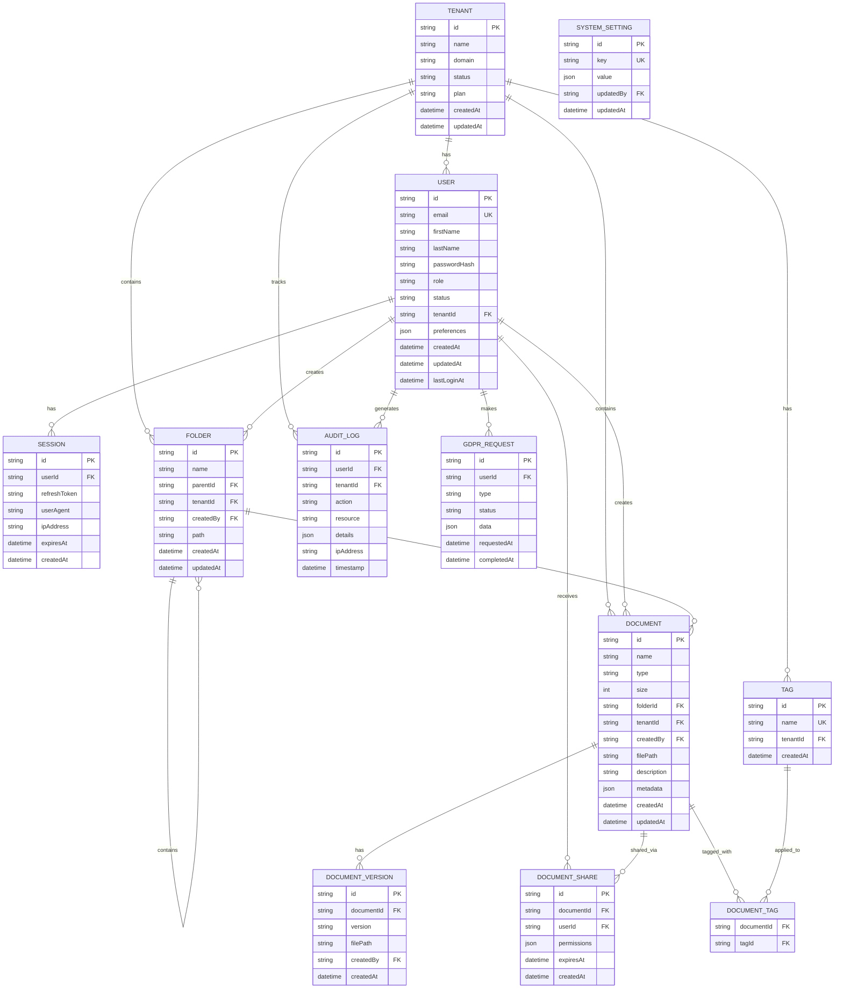

# Database Schema

**Versione:** 1.0  
**Data:** 27 Gennaio 2025  
**Autore:** Team Development

## 📋 Panoramica

Il database utilizza PostgreSQL 14+ con Prisma ORM per la gestione dello schema e delle migrazioni. Il design supporta multi-tenancy, GDPR compliance e scalabilità orizzontale.

## 🏗️ Architettura Database



## 📊 Schema Prisma

### Core Models

```prisma
// schema.prisma
generator client {
  provider = "prisma-client-js"
}

datasource db {
  provider = "postgresql"
  url      = env("DATABASE_URL")
}

// Tenant Model
model Tenant {
  id        String   @id @default(cuid())
  name      String
  domain    String   @unique
  status    TenantStatus @default(ACTIVE)
  plan      TenantPlan   @default(BASIC)
  settings  Json?    @default("{}")
  createdAt DateTime @default(now())
  updatedAt DateTime @updatedAt
  
  // Relations
  users     User[]
  folders   Folder[]
  documents Document[]
  tags      Tag[]
  auditLogs AuditLog[]
  
  @@map("tenants")
}

enum TenantStatus {
  ACTIVE
  INACTIVE
  SUSPENDED
}

enum TenantPlan {
  BASIC
  PREMIUM
  ENTERPRISE
}

// User Model
model User {
  id           String    @id @default(cuid())
  email        String    @unique
  firstName    String
  lastName     String
  passwordHash String
  role         UserRole  @default(USER)
  status       UserStatus @default(ACTIVE)
  tenantId     String
  preferences  Json?     @default("{}")
  createdAt    DateTime  @default(now())
  updatedAt    DateTime  @updatedAt
  lastLoginAt  DateTime?
  
  // Relations
  tenant          Tenant           @relation(fields: [tenantId], references: [id], onDelete: Cascade)
  sessions        Session[]
  createdFolders  Folder[]         @relation("FolderCreator")
  createdDocuments Document[]       @relation("DocumentCreator")
  documentShares  DocumentShare[]
  auditLogs       AuditLog[]
  gdprRequests    GdprRequest[]
  
  @@index([tenantId])
  @@index([email])
  @@map("users")
}

enum UserRole {
  ADMIN
  USER
  VIEWER
}

enum UserStatus {
  ACTIVE
  INACTIVE
  SUSPENDED
}

// Session Model
model Session {
  id           String   @id @default(cuid())
  userId       String
  refreshToken String   @unique
  userAgent    String?
  ipAddress    String?
  expiresAt    DateTime
  createdAt    DateTime @default(now())
  
  // Relations
  user User @relation(fields: [userId], references: [id], onDelete: Cascade)
  
  @@index([userId])
  @@index([expiresAt])
  @@map("sessions")
}

// Folder Model
model Folder {
  id        String   @id @default(cuid())
  name      String
  parentId  String?
  tenantId  String
  createdBy String
  path      String
  createdAt DateTime @default(now())
  updatedAt DateTime @updatedAt
  
  // Relations
  tenant      Tenant     @relation(fields: [tenantId], references: [id], onDelete: Cascade)
  creator     User       @relation("FolderCreator", fields: [createdBy], references: [id])
  parent      Folder?    @relation("FolderHierarchy", fields: [parentId], references: [id])
  subfolders  Folder[]   @relation("FolderHierarchy")
  documents   Document[]
  
  @@unique([tenantId, path])
  @@index([tenantId])
  @@index([parentId])
  @@map("folders")
}

// Document Model
model Document {
  id          String   @id @default(cuid())
  name        String
  type        String
  size        Int
  folderId    String?
  tenantId    String
  createdBy   String
  filePath    String
  description String?
  metadata    Json?    @default("{}")
  createdAt   DateTime @default(now())
  updatedAt   DateTime @updatedAt
  
  // Relations
  tenant     Tenant           @relation(fields: [tenantId], references: [id], onDelete: Cascade)
  creator    User             @relation("DocumentCreator", fields: [createdBy], references: [id])
  folder     Folder?          @relation(fields: [folderId], references: [id])
  versions   DocumentVersion[]
  shares     DocumentShare[]
  tags       DocumentTag[]
  
  @@index([tenantId])
  @@index([folderId])
  @@index([createdBy])
  @@index([type])
  @@map("documents")
}

// Document Version Model
model DocumentVersion {
  id         String   @id @default(cuid())
  documentId String
  version    String
  filePath   String
  createdBy  String
  createdAt  DateTime @default(now())
  
  // Relations
  document Document @relation(fields: [documentId], references: [id], onDelete: Cascade)
  creator  User     @relation(fields: [createdBy], references: [id])
  
  @@unique([documentId, version])
  @@index([documentId])
  @@map("document_versions")
}

// Document Share Model
model DocumentShare {
  id          String    @id @default(cuid())
  documentId  String
  userId      String
  permissions Json      @default("[]")
  expiresAt   DateTime?
  createdAt   DateTime  @default(now())
  
  // Relations
  document Document @relation(fields: [documentId], references: [id], onDelete: Cascade)
  user     User     @relation(fields: [userId], references: [id], onDelete: Cascade)
  
  @@unique([documentId, userId])
  @@index([userId])
  @@index([expiresAt])
  @@map("document_shares")
}

// Tag Model
model Tag {
  id        String   @id @default(cuid())
  name      String
  tenantId  String
  createdAt DateTime @default(now())
  
  // Relations
  tenant    Tenant      @relation(fields: [tenantId], references: [id], onDelete: Cascade)
  documents DocumentTag[]
  
  @@unique([tenantId, name])
  @@index([tenantId])
  @@map("tags")
}

// Document Tag Junction Model
model DocumentTag {
  documentId String
  tagId      String
  
  // Relations
  document Document @relation(fields: [documentId], references: [id], onDelete: Cascade)
  tag      Tag      @relation(fields: [tagId], references: [id], onDelete: Cascade)
  
  @@id([documentId, tagId])
  @@map("document_tags")
}

// Audit Log Model
model AuditLog {
  id        String   @id @default(cuid())
  userId    String?
  tenantId  String
  action    String
  resource  String
  details   Json?    @default("{}")
  ipAddress String?
  timestamp DateTime @default(now())
  
  // Relations
  user   User?  @relation(fields: [userId], references: [id])
  tenant Tenant @relation(fields: [tenantId], references: [id], onDelete: Cascade)
  
  @@index([tenantId])
  @@index([userId])
  @@index([action])
  @@index([timestamp])
  @@map("audit_logs")
}

// GDPR Request Model
model GdprRequest {
  id          String      @id @default(cuid())
  userId      String
  type        GdprType
  status      GdprStatus  @default(PENDING)
  data        Json?       @default("{}")
  requestedAt DateTime    @default(now())
  completedAt DateTime?
  
  // Relations
  user User @relation(fields: [userId], references: [id], onDelete: Cascade)
  
  @@index([userId])
  @@index([status])
  @@map("gdpr_requests")
}

enum GdprType {
  DATA_EXPORT
  DATA_DELETION
  DATA_RECTIFICATION
}

enum GdprStatus {
  PENDING
  PROCESSING
  COMPLETED
  FAILED
}

// System Setting Model
model SystemSetting {
  id        String   @id @default(cuid())
  key       String   @unique
  value     Json
  updatedBy String?
  updatedAt DateTime @updatedAt
  
  // Relations
  updater User? @relation(fields: [updatedBy], references: [id])
  
  @@map("system_settings")
}
```

## 🔍 Indici e Performance

### Indici Principali

```sql
-- User indices
CREATE INDEX idx_users_tenant_id ON users(tenant_id);
CREATE INDEX idx_users_email ON users(email);
CREATE INDEX idx_users_last_login ON users(last_login_at);
CREATE INDEX idx_users_status ON users(status);

-- Document indices
CREATE INDEX idx_documents_tenant_id ON documents(tenant_id);
CREATE INDEX idx_documents_folder_id ON documents(folder_id);
CREATE INDEX idx_documents_created_by ON documents(created_by);
CREATE INDEX idx_documents_type ON documents(type);
CREATE INDEX idx_documents_created_at ON documents(created_at);
CREATE INDEX idx_documents_name_gin ON documents USING gin(to_tsvector('english', name));

-- Folder indices
CREATE INDEX idx_folders_tenant_id ON folders(tenant_id);
CREATE INDEX idx_folders_parent_id ON folders(parent_id);
CREATE INDEX idx_folders_path ON folders(path);

-- Session indices
CREATE INDEX idx_sessions_user_id ON sessions(user_id);
CREATE INDEX idx_sessions_expires_at ON sessions(expires_at);
CREATE INDEX idx_sessions_refresh_token ON sessions(refresh_token);

-- Audit log indices
CREATE INDEX idx_audit_logs_tenant_id ON audit_logs(tenant_id);
CREATE INDEX idx_audit_logs_user_id ON audit_logs(user_id);
CREATE INDEX idx_audit_logs_action ON audit_logs(action);
CREATE INDEX idx_audit_logs_timestamp ON audit_logs(timestamp);
CREATE INDEX idx_audit_logs_resource ON audit_logs(resource);

-- Document share indices
CREATE INDEX idx_document_shares_user_id ON document_shares(user_id);
CREATE INDEX idx_document_shares_expires_at ON document_shares(expires_at);

-- Full-text search indices
CREATE INDEX idx_documents_content_gin ON documents USING gin(to_tsvector('english', coalesce(description, '')));
CREATE INDEX idx_folders_name_gin ON folders USING gin(to_tsvector('english', name));
```

### Indici Compositi

```sql
-- Composite indices for common queries
CREATE INDEX idx_documents_tenant_folder ON documents(tenant_id, folder_id);
CREATE INDEX idx_documents_tenant_created_at ON documents(tenant_id, created_at DESC);
CREATE INDEX idx_users_tenant_status ON users(tenant_id, status);
CREATE INDEX idx_audit_logs_tenant_timestamp ON audit_logs(tenant_id, timestamp DESC);
CREATE INDEX idx_sessions_user_expires ON sessions(user_id, expires_at);
```

## 🔒 Sicurezza Database

### Row Level Security (RLS)

```sql
-- Enable RLS on sensitive tables
ALTER TABLE users ENABLE ROW LEVEL SECURITY;
ALTER TABLE documents ENABLE ROW LEVEL SECURITY;
ALTER TABLE folders ENABLE ROW LEVEL SECURITY;
ALTER TABLE audit_logs ENABLE ROW LEVEL SECURITY;

-- Tenant isolation policy
CREATE POLICY tenant_isolation_users ON users
  FOR ALL TO application_user
  USING (tenant_id = current_setting('app.current_tenant_id'));

CREATE POLICY tenant_isolation_documents ON documents
  FOR ALL TO application_user
  USING (tenant_id = current_setting('app.current_tenant_id'));

CREATE POLICY tenant_isolation_folders ON folders
  FOR ALL TO application_user
  USING (tenant_id = current_setting('app.current_tenant_id'));

CREATE POLICY tenant_isolation_audit_logs ON audit_logs
  FOR ALL TO application_user
  USING (tenant_id = current_setting('app.current_tenant_id'));
```

### Encryption

```sql
-- Encrypted columns using pgcrypto
CREATE EXTENSION IF NOT EXISTS pgcrypto;

-- Function to encrypt sensitive data
CREATE OR REPLACE FUNCTION encrypt_sensitive_data(data TEXT)
RETURNS TEXT AS $$
BEGIN
  RETURN encode(encrypt(data::bytea, current_setting('app.encryption_key'), 'aes'), 'base64');
END;
$$ LANGUAGE plpgsql;

-- Function to decrypt sensitive data
CREATE OR REPLACE FUNCTION decrypt_sensitive_data(encrypted_data TEXT)
RETURNS TEXT AS $$
BEGIN
  RETURN convert_from(decrypt(decode(encrypted_data, 'base64'), current_setting('app.encryption_key'), 'aes'), 'UTF8');
END;
$$ LANGUAGE plpgsql;
```

## 📈 Ottimizzazioni Performance

### Partitioning

```sql
-- Partition audit_logs by month
CREATE TABLE audit_logs_partitioned (
  LIKE audit_logs INCLUDING ALL
) PARTITION BY RANGE (timestamp);

-- Create monthly partitions
CREATE TABLE audit_logs_2025_01 PARTITION OF audit_logs_partitioned
  FOR VALUES FROM ('2025-01-01') TO ('2025-02-01');

CREATE TABLE audit_logs_2025_02 PARTITION OF audit_logs_partitioned
  FOR VALUES FROM ('2025-02-01') TO ('2025-03-01');

-- Auto-create partitions function
CREATE OR REPLACE FUNCTION create_monthly_partition(table_name TEXT, start_date DATE)
RETURNS VOID AS $$
DECLARE
  partition_name TEXT;
  end_date DATE;
BEGIN
  partition_name := table_name || '_' || to_char(start_date, 'YYYY_MM');
  end_date := start_date + INTERVAL '1 month';
  
  EXECUTE format('CREATE TABLE IF NOT EXISTS %I PARTITION OF %I FOR VALUES FROM (%L) TO (%L)',
    partition_name, table_name, start_date, end_date);
END;
$$ LANGUAGE plpgsql;
```

### Materialized Views

```sql
-- Document statistics materialized view
CREATE MATERIALIZED VIEW document_stats AS
SELECT 
  tenant_id,
  COUNT(*) as total_documents,
  SUM(size) as total_size,
  COUNT(DISTINCT created_by) as unique_creators,
  COUNT(DISTINCT type) as unique_types,
  AVG(size) as avg_size,
  MAX(created_at) as last_upload
FROM documents
GROUP BY tenant_id;

CREATE UNIQUE INDEX ON document_stats (tenant_id);

-- User activity materialized view
CREATE MATERIALIZED VIEW user_activity_stats AS
SELECT 
  u.tenant_id,
  u.id as user_id,
  u.email,
  COUNT(d.id) as documents_created,
  COUNT(DISTINCT DATE(d.created_at)) as active_days,
  MAX(u.last_login_at) as last_login,
  COUNT(al.id) as total_actions
FROM users u
LEFT JOIN documents d ON u.id = d.created_by
LEFT JOIN audit_logs al ON u.id = al.user_id
GROUP BY u.tenant_id, u.id, u.email;

CREATE UNIQUE INDEX ON user_activity_stats (tenant_id, user_id);

-- Refresh materialized views function
CREATE OR REPLACE FUNCTION refresh_stats_views()
RETURNS VOID AS $$
BEGIN
  REFRESH MATERIALIZED VIEW CONCURRENTLY document_stats;
  REFRESH MATERIALIZED VIEW CONCURRENTLY user_activity_stats;
END;
$$ LANGUAGE plpgsql;
```

## 🔄 Migrazioni

### Migration Scripts

```sql
-- Migration: 001_initial_schema.sql
CREATE TABLE IF NOT EXISTS _prisma_migrations (
  id                      VARCHAR(36) PRIMARY KEY NOT NULL,
  checksum                VARCHAR(64) NOT NULL,
  finished_at             TIMESTAMPTZ,
  migration_name          VARCHAR(255) NOT NULL,
  logs                    TEXT,
  rolled_back_at          TIMESTAMPTZ,
  started_at              TIMESTAMPTZ NOT NULL DEFAULT now(),
  applied_steps_count     INTEGER NOT NULL DEFAULT 0
);

-- Migration: 002_add_full_text_search.sql
CREATE EXTENSION IF NOT EXISTS pg_trgm;
CREATE EXTENSION IF NOT EXISTS unaccent;

-- Add full-text search columns
ALTER TABLE documents ADD COLUMN IF NOT EXISTS search_vector tsvector;

-- Update search vector function
CREATE OR REPLACE FUNCTION update_document_search_vector()
RETURNS TRIGGER AS $$
BEGIN
  NEW.search_vector := to_tsvector('english', 
    coalesce(NEW.name, '') || ' ' || 
    coalesce(NEW.description, '') || ' ' ||
    coalesce((NEW.metadata->>'tags')::text, '')
  );
  RETURN NEW;
END;
$$ LANGUAGE plpgsql;

-- Create trigger for search vector updates
DROP TRIGGER IF EXISTS update_document_search_vector_trigger ON documents;
CREATE TRIGGER update_document_search_vector_trigger
  BEFORE INSERT OR UPDATE ON documents
  FOR EACH ROW EXECUTE FUNCTION update_document_search_vector();

-- Create GIN index for full-text search
CREATE INDEX IF NOT EXISTS idx_documents_search_vector ON documents USING gin(search_vector);
```

### Rollback Scripts

```sql
-- Rollback: 002_add_full_text_search.sql
DROP TRIGGER IF EXISTS update_document_search_vector_trigger ON documents;
DROP FUNCTION IF EXISTS update_document_search_vector();
DROP INDEX IF EXISTS idx_documents_search_vector;
ALTER TABLE documents DROP COLUMN IF EXISTS search_vector;
DROP EXTENSION IF EXISTS unaccent;
DROP EXTENSION IF EXISTS pg_trgm;
```

## 📊 Monitoring e Maintenance

### Database Health Checks

```sql
-- Check database size and growth
SELECT 
  schemaname,
  tablename,
  pg_size_pretty(pg_total_relation_size(schemaname||'.'||tablename)) as size,
  pg_size_pretty(pg_relation_size(schemaname||'.'||tablename)) as table_size,
  pg_size_pretty(pg_total_relation_size(schemaname||'.'||tablename) - pg_relation_size(schemaname||'.'||tablename)) as index_size
FROM pg_tables 
WHERE schemaname = 'public'
ORDER BY pg_total_relation_size(schemaname||'.'||tablename) DESC;

-- Check index usage
SELECT 
  schemaname,
  tablename,
  indexname,
  idx_scan as index_scans,
  idx_tup_read as tuples_read,
  idx_tup_fetch as tuples_fetched
FROM pg_stat_user_indexes
ORDER BY idx_scan DESC;

-- Check slow queries
SELECT 
  query,
  calls,
  total_time,
  mean_time,
  rows
FROM pg_stat_statements
ORDER BY mean_time DESC
LIMIT 10;
```

### Maintenance Tasks

```sql
-- Vacuum and analyze function
CREATE OR REPLACE FUNCTION maintenance_vacuum_analyze()
RETURNS VOID AS $$
DECLARE
  table_record RECORD;
BEGIN
  FOR table_record IN 
    SELECT schemaname, tablename 
    FROM pg_tables 
    WHERE schemaname = 'public'
  LOOP
    EXECUTE 'VACUUM ANALYZE ' || quote_ident(table_record.schemaname) || '.' || quote_ident(table_record.tablename);
  END LOOP;
END;
$$ LANGUAGE plpgsql;

-- Cleanup expired sessions
CREATE OR REPLACE FUNCTION cleanup_expired_sessions()
RETURNS INTEGER AS $$
DECLARE
  deleted_count INTEGER;
BEGIN
  DELETE FROM sessions WHERE expires_at < NOW();
  GET DIAGNOSTICS deleted_count = ROW_COUNT;
  RETURN deleted_count;
END;
$$ LANGUAGE plpgsql;

-- Archive old audit logs
CREATE OR REPLACE FUNCTION archive_old_audit_logs(days_to_keep INTEGER DEFAULT 90)
RETURNS INTEGER AS $$
DECLARE
  archived_count INTEGER;
BEGIN
  -- Move old logs to archive table
  INSERT INTO audit_logs_archive 
  SELECT * FROM audit_logs 
  WHERE timestamp < NOW() - INTERVAL '1 day' * days_to_keep;
  
  GET DIAGNOSTICS archived_count = ROW_COUNT;
  
  -- Delete archived logs from main table
  DELETE FROM audit_logs 
  WHERE timestamp < NOW() - INTERVAL '1 day' * days_to_keep;
  
  RETURN archived_count;
END;
$$ LANGUAGE plpgsql;
```

## 🔄 Backup Strategy

### Backup Configuration

```bash
#!/bin/bash
# backup_database.sh

DB_NAME="document_management"
BACKUP_DIR="/var/backups/postgresql"
DATE=$(date +"%Y%m%d_%H%M%S")
BACKUP_FILE="${BACKUP_DIR}/${DB_NAME}_${DATE}.sql.gz"

# Create backup directory if it doesn't exist
mkdir -p $BACKUP_DIR

# Create compressed backup
pg_dump $DB_NAME | gzip > $BACKUP_FILE

# Verify backup
if [ $? -eq 0 ]; then
  echo "Backup created successfully: $BACKUP_FILE"
  
  # Upload to S3 (optional)
  aws s3 cp $BACKUP_FILE s3://your-backup-bucket/postgresql/
  
  # Clean up old backups (keep last 7 days)
  find $BACKUP_DIR -name "${DB_NAME}_*.sql.gz" -mtime +7 -delete
else
  echo "Backup failed!"
  exit 1
fi
```

### Point-in-Time Recovery

```bash
# Enable WAL archiving in postgresql.conf
wal_level = replica
archive_mode = on
archive_command = 'cp %p /var/lib/postgresql/wal_archive/%f'
max_wal_senders = 3
wal_keep_segments = 32

# Create base backup
pg_basebackup -D /var/backups/postgresql/base -Ft -z -P

# Recovery script
#!/bin/bash
# restore_point_in_time.sh

RECOVERY_TARGET_TIME="2025-01-27 10:00:00"
BASE_BACKUP="/var/backups/postgresql/base/base.tar.gz"
DATA_DIR="/var/lib/postgresql/14/main"
WAL_ARCHIVE="/var/lib/postgresql/wal_archive"

# Stop PostgreSQL
sudo systemctl stop postgresql

# Restore base backup
sudo rm -rf $DATA_DIR
sudo mkdir -p $DATA_DIR
sudo tar -xzf $BASE_BACKUP -C $DATA_DIR

# Create recovery.conf
sudo tee $DATA_DIR/recovery.conf << EOF
restore_command = 'cp $WAL_ARCHIVE/%f %p'
recovery_target_time = '$RECOVERY_TARGET_TIME'
recovery_target_action = 'promote'
EOF

# Start PostgreSQL
sudo systemctl start postgresql
```

---

**Precedente:** [API Reference](../api/api-reference.md)  
**Prossimo:** [Deployment Guide](../../deployment/deployment-guide.md)  
**Correlato:** [System Overview](../architecture/system-overview.md)