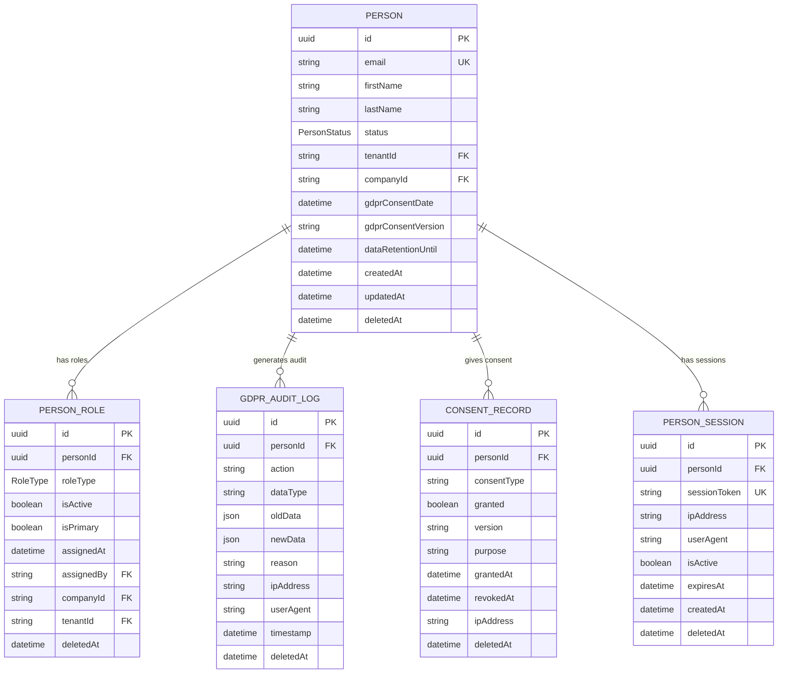

# Guida End-to-End: Implementazione Funzioni GDPR-Compliant nel Sistema Post-Refactoring

**Versione:** 2.0 Post-Refactoring  
**Data:** 29 Dicembre 2024  
**Stato:** Sistema Completamente Refactorizzato e Riorganizzato

## 📋 Panoramica Sistema Attuale

### Stato Post-Refactoring e Riorganizzazione
Il sistema ha completato con successo:

✅ **Refactoring Completo**:
- Entità `User` ed `Employee` eliminate → Sistema unificato `Person`
- Sistema ruoli unificato con `PersonRole` e `RoleType` enum
- Soft delete standardizzato con solo `deletedAt`
- GDPR compliance completa con `GdprAuditLog` e `ConsentRecord`

✅ **Riorganizzazione Documentazione**:
- Tutti i file di documentazione spostati in `docs/`
- Project rules consolidate in `.trae/rules/project_rules.md`
- Struttura organizzata per tipologia (tecnica, utente, deployment)
- Eliminazione duplicati e file obsoleti

✅ **Pulizia Sistema**:
- 156 file test obsoleti eliminati
- Documentazione consolidata e aggiornata
- Schema Prisma completamente migrato

### Architettura Attuale


## 🎯 Principi Fondamentali per Nuove Implementazioni

### 1. GDPR by Design
Ogni nuova funzione DEVE implementare:
- **Audit Trail Completo**: Tracciamento di tutte le operazioni sui dati personali
- **Consenso Granulare**: Verifica consensi specifici prima del processing
- **Minimizzazione Dati**: Solo dati strettamente necessari
- **Soft Delete**: Utilizzo esclusivo di `deletedAt`
- **Data Retention**: Rispetto delle politiche di conservazione

### 2. Sistema Person Unificato
Tutte le operazioni devono utilizzare:
- **Entità Person**: Unica entità per tutti gli utenti
- **PersonRole**: Sistema ruoli con `RoleType` enum
- **PersonSession**: Gestione sessioni unificata
- **Multi-tenancy**: Isolamento completo per tenant

### 3. Sicurezza e Autorizzazione
- **JWT Token**: Payload standardizzato con `personId`, `roles`, `sessionId`
- **Role-Based Access**: Controllo granulare basato su `PersonRole`
- **Tenant Isolation**: Separazione completa dei dati per tenant

## 🔧 Template di Implementazione End-to-End

### Fase 1: Analisi e Progettazione

#### 1.1 Checklist Iniziale GDPR
```markdown
- [ ] Identificare i dati personali coinvolti
- [ ] Definire il tipo di consenso necessario
- [ ] Mappare i ruoli autorizzati
- [ ] Pianificare l'audit trail
- [ ] Verificare compliance multi-tenant
- [ ] Definire politiche di retention
- [ ] Valutare impatto privacy (DPIA se necessario)
```

#### 1.2 Schema Database (se necessario)
```prisma
// Esempio: Nuova entità correlata a Person
model NewEntity {
  id        String   @id @default(uuid())
  personId  String   // SEMPRE collegare a Person
  data      String   // Dati specifici
  purpose   String   // Scopo del processing (GDPR)
  createdAt DateTime @default(now())
  updatedAt DateTime @updatedAt
  deletedAt DateTime? // SEMPRE soft delete
  
  // Relazioni obbligatorie
  person    Person   @relation(fields: [personId], references: [id], onDelete: Cascade)
  
  // Indici per performance
  @@index([personId])
  @@index([deletedAt]) // Per performance soft delete
  @@map("new_entities")
}
```

### Fase 2: Backend Implementation

#### 2.1 Controller GDPR-Compliant
```typescript
import { Request, Response } from 'express';
import { prisma } from '../config/database';
import { logGdprAction } from '../services/gdpr-service';
import { checkConsent } from '../services/consent-service';
import { z } from 'zod';

// Schema di validazione
const createEntitySchema = z.object({
  data: z.string().min(1, 'Dati richiesti'),
  purpose: z.string().min(1, 'Scopo richiesto per GDPR'),
  consentType: z.string().optional()
});

export class NewEntityController {
  
  // CREATE - Creazione con GDPR compliance
  async create(req: Request, res: Response) {
    try {
      // 1. Validazione input
      const validation = createEntitySchema.safeParse(req.body);
      if (!validation.success) {
        return res.status(400).json({ 
          error: 'Dati non validi',
          details: validation.error.errors 
        });
      }
      
      const { data, purpose, consentType } = validation.data;
      const personId = req.person!.id; // Da middleware auth
      
      // 2. Verifica autorizzazione
      if (!this.canCreateEntity(req.person!)) {
        return res.status(403).json({ error: 'Accesso negato' });
      }
      
      // 3. Verifica consenso GDPR (se necessario)
      if (consentType) {
        const hasConsent = await checkConsent(personId, consentType);
        if (!hasConsent) {
          return res.status(403).json({ 
            error: 'Consenso richiesto',
            consentType,
            message: `È necessario il consenso per '${consentType}' per procedere.`
          });
        }
      }
      
      // 4. Creazione entità
      const entity = await prisma.newEntity.create({
        data: {
          personId,
          data,
          purpose
        }
      });
      
      // 5. Audit log OBBLIGATORIO
      await logGdprAction({
        personId,
        action: 'CREATE_ENTITY',
        dataType: 'PERSONAL_DATA',
        newData: entity,
        reason: purpose,
        ipAddress: req.ip,
        userAgent: req.get('User-Agent')
      });
      
      res.status(201).json({ success: true, data: entity });
    } catch (error) {
      console.error('Errore creazione entità:', error);
      res.status(500).json({ error: 'Errore interno del server' });
    }
  }
  
  // READ - Lettura con controlli GDPR
  async getById(req: Request, res: Response) {
    try {
      const { id } = req.params;
      const requestingPersonId = req.person!.id;
      
      // 1. Recupera entità con controlli tenant
      const entity = await prisma.newEntity.findFirst({
        where: {
          id,
          deletedAt: null,
          person: {
            tenantId: req.person!.tenantId // Isolamento tenant
          }
        },
        include: {
          person: {
            select: {
              id: true,
              email: true,
              firstName: true,
              lastName: true
            }
          }
        }
      });
      
      if (!entity) {
        return res.status(404).json({ error: 'Entità non trovata' });
      }
      
      // 2. Verifica autorizzazione lettura
      if (!this.canReadEntity(req.person!, entity)) {
        return res.status(403).json({ error: 'Accesso negato' });
      }
      
      // 3. Audit log per accesso dati
      await logGdprAction({
        personId: entity.personId,
        action: 'VIEW_PERSONAL_DATA',
        dataType: 'ENTITY_DATA',
        reason: 'Data access request',
        ipAddress: req.ip,
        userAgent: req.get('User-Agent')
      });
      
      res.json({ success: true, data: entity });
    } catch (error) {
      console.error('Errore lettura entità:', error);
      res.status(500).json({ error: 'Errore interno del server' });
    }
  }
  
  // UPDATE - Aggiornamento con GDPR compliance
  async update(req: Request, res: Response) {
    try {
      const { id } = req.params;
      
      // 1. Validazione input
      const validation = createEntitySchema.partial().safeParse(req.body);
      if (!validation.success) {
        return res.status(400).json({ 
          error: 'Dati non validi',
          details: validation.error.errors 
        });
      }
      
      // 2. Recupera entità esistente
      const existingEntity = await prisma.newEntity.findFirst({
        where: {
          id,
          deletedAt: null,
          person: {
            tenantId: req.person!.tenantId
          }
        }
      });
      
      if (!existingEntity) {
        return res.status(404).json({ error: 'Entità non trovata' });
      }
      
      // 3. Verifica autorizzazione
      if (!this.canUpdateEntity(req.person!, existingEntity)) {
        return res.status(403).json({ error: 'Accesso negato' });
      }
      
      // 4. Backup per audit
      const oldData = { ...existingEntity };
      
      // 5. Aggiornamento
      const updatedEntity = await prisma.newEntity.update({
        where: { id },
        data: validation.data
      });
      
      // 6. Audit log OBBLIGATORIO
      await logGdprAction({
        personId: existingEntity.personId,
        action: 'UPDATE_ENTITY',
        dataType: 'PERSONAL_DATA',
        oldData,
        newData: updatedEntity,
        reason: 'Entity update',
        ipAddress: req.ip,
        userAgent: req.get('User-Agent')
      });
      
      res.json({ success: true, data: updatedEntity });
    } catch (error) {
      console.error('Errore aggiornamento entità:', error);
      res.status(500).json({ error: 'Errore interno del server' });
    }
  }
  
  // DELETE - Soft delete con GDPR compliance
  async delete(req: Request, res: Response) {
    try {
      const { id } = req.params;
      
      // 1. Recupera entità
      const entity = await prisma.newEntity.findFirst({
        where: {
          id,
          deletedAt: null,
          person: {
            tenantId: req.person!.tenantId
          }
        }
      });
      
      if (!entity) {
        return res.status(404).json({ error: 'Entità non trovata' });
      }
      
      // 2. Verifica autorizzazione
      if (!this.canDeleteEntity(req.person!, entity)) {
        return res.status(403).json({ error: 'Accesso negato' });
      }
      
      // 3. Soft delete
      const deletedEntity = await prisma.newEntity.update({
        where: { id },
        data: { deletedAt: new Date() }
      });
      
      // 4. Audit log OBBLIGATORIO
      await logGdprAction({
        personId: entity.personId,
        action: 'DELETE_ENTITY',
        dataType: 'PERSONAL_DATA',
        oldData: entity,
        reason: 'Entity deletion',
        ipAddress: req.ip,
        userAgent: req.get('User-Agent')
      });
      
      res.json({ success: true, message: 'Entità eliminata' });
    } catch (error) {
      console.error('Errore eliminazione entità:', error);
      res.status(500).json({ error: 'Errore interno del server' });
    }
  }
  
  // Metodi di autorizzazione
  private canCreateEntity(person: any): boolean {
    return person.roles.some((role: any) => 
      ['ADMIN', 'MANAGER'].includes(role.roleType) && role.isActive
    );
  }
  
  private canReadEntity(person: any, entity: any): boolean {
    // Può leggere i propri dati o se ha ruolo appropriato
    return entity.personId === person.id || 
           person.roles.some((role: any) => 
             ['ADMIN', 'MANAGER'].includes(role.roleType) && role.isActive
           );
  }
  
  private canUpdateEntity(person: any, entity: any): boolean {
    return entity.personId === person.id || 
           person.roles.some((role: any) => 
             ['ADMIN'].includes(role.roleType) && role.isActive
           );
  }
  
  private canDeleteEntity(person: any, entity: any): boolean {
    return person.roles.some((role: any) => 
      ['ADMIN'].includes(role.roleType) && role.isActive
    );
  }
}
```

#### 2.2 Routes con Middleware GDPR
```typescript
import { Router } from 'express';
import { NewEntityController } from '../controllers/newEntityController';
import { authenticateToken } from '../middleware/auth';
import { validateTenant } from '../middleware/tenant';
import { rateLimiter } from '../middleware/rateLimiter';

const router = Router();
const controller = new NewEntityController();

// Middleware obbligatori per tutte le route
router.use(authenticateToken); // Autenticazione
router.use(validateTenant);    // Validazione tenant
router.use(rateLimiter);       // Rate limiting

// Routes CRUD
router.post('/', controller.create.bind(controller));
router.get('/:id', controller.getById.bind(controller));
router.put('/:id', controller.update.bind(controller));
router.delete('/:id', controller.delete.bind(controller));

export default router;
```

### Fase 3: Service Layer

#### 3.1 GDPR Service
```typescript
import { prisma } from '../config/database';

interface GdprActionData {
  personId: string;
  action: string;
  dataType: string;
  oldData?: any;
  newData?: any;
  reason: string;
  ipAddress?: string;
  userAgent?: string;
}

export async function logGdprAction(data: GdprActionData): Promise<void> {
  try {
    await prisma.gdprAuditLog.create({
      data: {
        personId: data.personId,
        action: data.action,
        dataType: data.dataType,
        oldData: data.oldData ? JSON.stringify(data.oldData) : null,
        newData: data.newData ? JSON.stringify(data.newData) : null,
        reason: data.reason,
        ipAddress: data.ipAddress || 'unknown',
        userAgent: data.userAgent || 'unknown',
        timestamp: new Date()
      }
    });
  } catch (error) {
    console.error('Errore logging GDPR:', error);
    // Non bloccare l'operazione principale per errori di logging
  }
}

export async function checkConsent(personId: string, consentType: string): Promise<boolean> {
  try {
    const consent = await prisma.consentRecord.findFirst({
      where: {
        personId,
        consentType,
        granted: true,
        revokedAt: null,
        deletedAt: null
      },
      orderBy: {
        grantedAt: 'desc'
      }
    });
    
    return !!consent;
  } catch (error) {
    console.error('Errore verifica consenso:', error);
    return false; // Fail-safe: nessun consenso in caso di errore
  }
}

export async function exportPersonData(personId: string): Promise<any> {
  try {
    const person = await prisma.person.findUnique({
      where: { id: personId, deletedAt: null },
      include: {
        personRoles: { where: { deletedAt: null } },
        courseEnrollments: { where: { deletedAt: null } },
        refreshTokens: true,
        gdprAuditLogs: {
          orderBy: { timestamp: 'desc' },
          take: 100 // Ultimi 100 log
        },
        consentRecords: { where: { deletedAt: null } }
      }
    });
    
    if (!person) {
      throw new Error('Person non trovata');
    }
    
    // Log dell'export
    await logGdprAction({
      personId,
      action: 'EXPORT_PERSONAL_DATA',
      dataType: 'COMPLETE_PROFILE',
      reason: 'Data portability request'
    });
    
    return {
      personalData: {
        id: person.id,
        email: person.email,
        firstName: person.firstName,
        lastName: person.lastName,
        status: person.status,
        createdAt: person.createdAt,
        gdprConsentDate: person.gdprConsentDate,
        gdprConsentVersion: person.gdprConsentVersion
      },
      roles: person.personRoles.map(role => ({
        roleType: role.roleType,
        isActive: role.isActive,
        assignedAt: role.assignedAt
      })),
      enrollments: person.courseEnrollments,
      loginHistory: person.refreshTokens.map(token => ({
        loginAt: token.createdAt,
        deviceInfo: token.deviceInfo
      })),
      auditTrail: person.gdprAuditLogs,
      consents: person.consentRecords
    };
  } catch (error) {
    console.error('Errore export dati:', error);
    throw error;
  }
}
```

### Fase 4: Frontend Integration

#### 4.1 API Service
```typescript
// services/newEntityService.ts
import { apiClient } from './apiClient';

export interface NewEntity {
  id: string;
  personId: string;
  data: string;
  purpose: string;
  createdAt: string;
  updatedAt: string;
}

export interface CreateEntityRequest {
  data: string;
  purpose: string;
  consentType?: string;
}

class NewEntityService {
  private baseUrl = '/api/v1/entities';
  
  async create(data: CreateEntityRequest): Promise<NewEntity> {
    const response = await apiClient.post(this.baseUrl, data);
    return response.data.data;
  }
  
  async getById(id: string): Promise<NewEntity> {
    const response = await apiClient.get(`${this.baseUrl}/${id}`);
    return response.data.data;
  }
  
  async update(id: string, data: Partial<CreateEntityRequest>): Promise<NewEntity> {
    const response = await apiClient.put(`${this.baseUrl}/${id}`, data);
    return response.data.data;
  }
  
  async delete(id: string): Promise<void> {
    await apiClient.delete(`${this.baseUrl}/${id}`);
  }
}

export const newEntityService = new NewEntityService();
```

#### 4.2 React Component con Consenso GDPR
```tsx
// components/NewEntityForm.tsx
import React, { useState } from 'react';
import { newEntityService, CreateEntityRequest } from '../services/newEntityService';
import { ConsentModal } from './ConsentModal';

interface NewEntityFormProps {
  onSuccess?: (entity: any) => void;
  onError?: (error: string) => void;
}

export const NewEntityForm: React.FC<NewEntityFormProps> = ({ onSuccess, onError }) => {
  const [formData, setFormData] = useState<CreateEntityRequest>({
    data: '',
    purpose: '',
    consentType: 'DATA_PROCESSING'
  });
  const [loading, setLoading] = useState(false);
  const [showConsentModal, setShowConsentModal] = useState(false);
  const [consentGranted, setConsentGranted] = useState(false);
  
  const handleSubmit = async (e: React.FormEvent) => {
    e.preventDefault();
    
    // Verifica consenso se necessario
    if (formData.consentType && !consentGranted) {
      setShowConsentModal(true);
      return;
    }
    
    setLoading(true);
    try {
      const entity = await newEntityService.create(formData);
      onSuccess?.(entity);
      
      // Reset form
      setFormData({ data: '', purpose: '', consentType: 'DATA_PROCESSING' });
      setConsentGranted(false);
    } catch (error: any) {
      const errorMessage = error.response?.data?.error || 'Errore durante la creazione';
      onError?.(errorMessage);
    } finally {
      setLoading(false);
    }
  };
  
  const handleConsentGranted = () => {
    setConsentGranted(true);
    setShowConsentModal(false);
    // Riprova il submit
    handleSubmit(new Event('submit') as any);
  };
  
  return (
    <>
      <form onSubmit={handleSubmit} className="space-y-4">
        <div>
          <label htmlFor="data" className="block text-sm font-medium text-gray-700">
            Dati
          </label>
          <input
            type="text"
            id="data"
            value={formData.data}
            onChange={(e) => setFormData({ ...formData, data: e.target.value })}
            required
            className="mt-1 block w-full rounded-md border-gray-300 shadow-sm focus:border-indigo-500 focus:ring-indigo-500"
          />
        </div>
        
        <div>
          <label htmlFor="purpose" className="block text-sm font-medium text-gray-700">
            Scopo del Trattamento (GDPR)
          </label>
          <textarea
            id="purpose"
            value={formData.purpose}
            onChange={(e) => setFormData({ ...formData, purpose: e.target.value })}
            required
            rows={3}
            className="mt-1 block w-full rounded-md border-gray-300 shadow-sm focus:border-indigo-500 focus:ring-indigo-500"
            placeholder="Descrivi lo scopo per cui questi dati verranno utilizzati..."
          />
        </div>
        
        <div>
          <label htmlFor="consentType" className="block text-sm font-medium text-gray-700">
            Tipo di Consenso
          </label>
          <select
            id="consentType"
            value={formData.consentType}
            onChange={(e) => setFormData({ ...formData, consentType: e.target.value })}
            className="mt-1 block w-full rounded-md border-gray-300 shadow-sm focus:border-indigo-500 focus:ring-indigo-500"
          >
            <option value="DATA_PROCESSING">Trattamento Dati</option>
            <option value="MARKETING">Marketing</option>
            <option value="ANALYTICS">Analytics</option>
            <option value="PROFILING">Profilazione</option>
          </select>
        </div>
        
        <button
          type="submit"
          disabled={loading}
          className="w-full flex justify-center py-2 px-4 border border-transparent rounded-md shadow-sm text-sm font-medium text-white bg-indigo-600 hover:bg-indigo-700 focus:outline-none focus:ring-2 focus:ring-offset-2 focus:ring-indigo-500 disabled:opacity-50"
        >
          {loading ? 'Creazione in corso...' : 'Crea Entità'}
        </button>
      </form>
      
      {showConsentModal && (
        <ConsentModal
          consentType={formData.consentType!}
          purpose={formData.purpose}
          onGranted={handleConsentGranted}
          onDenied={() => setShowConsentModal(false)}
        />
      )}
    </>
  );
};
```

#### 4.3 Consent Modal Component
```tsx
// components/ConsentModal.tsx
import React from 'react';

interface ConsentModalProps {
  consentType: string;
  purpose: string;
  onGranted: () => void;
  onDenied: () => void;
}

const CONSENT_DESCRIPTIONS = {
  DATA_PROCESSING: 'Consenso per il trattamento dei tuoi dati personali',
  MARKETING: 'Consenso per l\'invio di comunicazioni marketing',
  ANALYTICS: 'Consenso per l\'analisi del comportamento utente',
  PROFILING: 'Consenso per la profilazione e personalizzazione'
};

export const ConsentModal: React.FC<ConsentModalProps> = ({
  consentType,
  purpose,
  onGranted,
  onDenied
}) => {
  return (
    <div className="fixed inset-0 bg-gray-600 bg-opacity-50 overflow-y-auto h-full w-full z-50">
      <div className="relative top-20 mx-auto p-5 border w-96 shadow-lg rounded-md bg-white">
        <div className="mt-3">
          <div className="mx-auto flex items-center justify-center h-12 w-12 rounded-full bg-blue-100">
            <svg className="h-6 w-6 text-blue-600" fill="none" stroke="currentColor" viewBox="0 0 24 24">
              <path strokeLinecap="round" strokeLinejoin="round" strokeWidth="2" d="M13 16h-1v-4h-1m1-4h.01M21 12a9 9 0 11-18 0 9 9 0 0118 0z" />
            </svg>
          </div>
          
          <h3 className="text-lg font-medium text-gray-900 text-center mt-4">
            Consenso Richiesto
          </h3>
          
          <div className="mt-4 text-sm text-gray-600">
            <p className="font-medium mb-2">
              {CONSENT_DESCRIPTIONS[consentType as keyof typeof CONSENT_DESCRIPTIONS]}
            </p>
            
            <div className="bg-gray-50 p-3 rounded-md">
              <p className="font-medium text-gray-700 mb-1">Scopo del trattamento:</p>
              <p className="text-gray-600">{purpose}</p>
            </div>
            
            <div className="mt-3 text-xs text-gray-500">
              <p>Ai sensi del GDPR (Regolamento UE 2016/679), hai il diritto di:</p>
              <ul className="list-disc list-inside mt-1 space-y-1">
                <li>Revocare il consenso in qualsiasi momento</li>
                <li>Accedere ai tuoi dati personali</li>
                <li>Richiedere la cancellazione dei dati</li>
                <li>Richiedere la portabilità dei dati</li>
              </ul>
            </div>
          </div>
          
          <div className="flex space-x-3 mt-6">
            <button
              onClick={onDenied}
              className="flex-1 px-4 py-2 bg-gray-300 text-gray-700 text-sm font-medium rounded-md hover:bg-gray-400 focus:outline-none focus:ring-2 focus:ring-gray-300"
            >
              Rifiuta
            </button>
            <button
              onClick={onGranted}
              className="flex-1 px-4 py-2 bg-blue-600 text-white text-sm font-medium rounded-md hover:bg-blue-700 focus:outline-none focus:ring-2 focus:ring-blue-500"
            >
              Accetto
            </button>
          </div>
        </div>
      </div>
    </div>
  );
};
```

### Fase 5: Testing

#### 5.1 Unit Tests
```typescript
// tests/newEntityController.test.ts
import { NewEntityController } from '../controllers/newEntityController';
import { prisma } from '../config/database';
import { logGdprAction } from '../services/gdpr-service';

// Mock dependencies
jest.mock('../config/database');
jest.mock('../services/gdpr-service');

const mockPrisma = prisma as jest.Mocked<typeof prisma>;
const mockLogGdprAction = logGdprAction as jest.MockedFunction<typeof logGdprAction>;

describe('NewEntityController', () => {
  let controller: NewEntityController;
  let mockReq: any;
  let mockRes: any;
  
  beforeEach(() => {
    controller = new NewEntityController();
    mockReq = {
      body: {},
      params: {},
      person: {
        id: 'person-123',
        tenantId: 'tenant-123',
        roles: [{ roleType: 'ADMIN', isActive: true }]
      },
      ip: '127.0.0.1',
      get: jest.fn().mockReturnValue('test-user-agent')
    };
    mockRes = {
      status: jest.fn().mockReturnThis(),
      json: jest.fn().mockReturnThis()
    };
    
    jest.clearAllMocks();
  });
  
  describe('create', () => {
    it('should create entity with valid data', async () => {
      // Arrange
      const entityData = {
        data: 'test data',
        purpose: 'test purpose'
      };
      const createdEntity = {
        id: 'entity-123',
        personId: 'person-123',
        ...entityData,
        createdAt: new Date(),
        updatedAt: new Date(),
        deletedAt: null
      };
      
      mockReq.body = entityData;
      mockPrisma.newEntity.create.mockResolvedValue(createdEntity);
      
      // Act
      await controller.create(mockReq, mockRes);
      
      // Assert
      expect(mockPrisma.newEntity.create).toHaveBeenCalledWith({
        data: {
          personId: 'person-123',
          data: 'test data',
          purpose: 'test purpose'
        }
      });
      
      expect(mockLogGdprAction).toHaveBeenCalledWith({
        personId: 'person-123',
        action: 'CREATE_ENTITY',
        dataType: 'PERSONAL_DATA',
        newData: createdEntity,
        reason: 'test purpose',
        ipAddress: '127.0.0.1',
        userAgent: 'test-user-agent'
      });
      
      expect(mockRes.status).toHaveBeenCalledWith(201);
      expect(mockRes.json).toHaveBeenCalledWith({
        success: true,
        data: createdEntity
      });
    });
    
    it('should return 400 for invalid data', async () => {
      // Arrange
      mockReq.body = { data: '' }; // Missing purpose
      
      // Act
      await controller.create(mockReq, mockRes);
      
      // Assert
      expect(mockRes.status).toHaveBeenCalledWith(400);
      expect(mockRes.json).toHaveBeenCalledWith({
        error: 'Dati non validi',
        details: expect.any(Array)
      });
    });
    
    it('should return 403 for unauthorized user', async () => {
      // Arrange
      mockReq.person.roles = [{ roleType: 'EMPLOYEE', isActive: true }];
      mockReq.body = { data: 'test', purpose: 'test' };
      
      // Act
      await controller.create(mockReq, mockRes);
      
      // Assert
      expect(mockRes.status).toHaveBeenCalledWith(403);
      expect(mockRes.json).toHaveBeenCalledWith({
        error: 'Accesso negato'
      });
    });
  });
  
  describe('GDPR compliance', () => {
    it('should log all CRUD operations', async () => {
      // Test che verifica che tutte le operazioni CRUD generino audit log
      const entityData = { data: 'test', purpose: 'test' };
      const entity = { id: 'entity-123', personId: 'person-123', ...entityData };
      
      mockReq.body = entityData;
      mockPrisma.newEntity.create.mockResolvedValue(entity);
      
      await controller.create(mockReq, mockRes);
      
      expect(mockLogGdprAction).toHaveBeenCalledWith(
        expect.objectContaining({
          action: 'CREATE_ENTITY',
          dataType: 'PERSONAL_DATA'
        })
      );
    });
    
    it('should enforce tenant isolation', async () => {
      // Test che verifica l'isolamento dei tenant
      mockReq.params.id = 'entity-123';
      
      await controller.getById(mockReq, mockRes);
      
      expect(mockPrisma.newEntity.findFirst).toHaveBeenCalledWith(
        expect.objectContaining({
          where: expect.objectContaining({
            person: {
              tenantId: 'tenant-123'
            }
          })
        })
      );
    });
  });
});
```

#### 5.2 Integration Tests
```typescript
// tests/integration/newEntity.integration.test.ts
import request from 'supertest';
import { app } from '../../app';
import { prisma } from '../../config/database';
import { generateTestToken } from '../helpers/auth';

describe('NewEntity Integration Tests', () => {
  let authToken: string;
  let testPersonId: string;
  
  beforeAll(async () => {
    // Setup test data
    const testPerson = await prisma.person.create({
      data: {
        email: 'test@example.com',
        firstName: 'Test',
        lastName: 'User',
        status: 'ACTIVE',
        tenantId: 'test-tenant',
        companyId: 'test-company'
      }
    });
    
    testPersonId = testPerson.id;
    
    await prisma.personRole.create({
      data: {
        personId: testPersonId,
        roleType: 'ADMIN',
        isActive: true,
        tenantId: 'test-tenant',
        companyId: 'test-company'
      }
    });
    
    authToken = generateTestToken(testPerson);
  });
  
  afterAll(async () => {
    // Cleanup
    await prisma.newEntity.deleteMany({ where: { personId: testPersonId } });
    await prisma.personRole.deleteMany({ where: { personId: testPersonId } });
    await prisma.person.delete({ where: { id: testPersonId } });
  });
  
  describe('POST /api/v1/entities', () => {
    it('should create entity and log GDPR action', async () => {
      const entityData = {
        data: 'Integration test data',
        purpose: 'Testing GDPR compliance'
      };
      
      const response = await request(app)
        .post('/api/v1/entities')
        .set('Authorization', `Bearer ${authToken}`)
        .send(entityData)
        .expect(201);
      
      expect(response.body.success).toBe(true);
      expect(response.body.data).toMatchObject({
        personId: testPersonId,
        data: entityData.data,
        purpose: entityData.purpose
      });
      
      // Verifica audit log
      const auditLog = await prisma.gdprAuditLog.findFirst({
        where: {
          personId: testPersonId,
          action: 'CREATE_ENTITY'
        },
        orderBy: { timestamp: 'desc' }
      });
      
      expect(auditLog).toBeTruthy();
      expect(auditLog!.dataType).toBe('PERSONAL_DATA');
      expect(auditLog!.reason).toBe(entityData.purpose);
    });
    
    it('should enforce tenant isolation', async () => {
      // Crea un altro utente in un tenant diverso
      const otherPerson = await prisma.person.create({
        data: {
          email: 'other@example.com',
          firstName: 'Other',
          lastName: 'User',
          status: 'ACTIVE',
          tenantId: 'other-tenant',
          companyId: 'other-company'
        }
      });
      
      const otherToken = generateTestToken(otherPerson);
      
      // Crea entità con il primo utente
      const createResponse = await request(app)
        .post('/api/v1/entities')
        .set('Authorization', `Bearer ${authToken}`)
        .send({
          data: 'Tenant isolation test',
          purpose: 'Testing tenant isolation'
        })
        .expect(201);
      
      const entityId = createResponse.body.data.id;
      
      // Prova ad accedere con l'altro utente (diverso tenant)
      await request(app)
        .get(`/api/v1/entities/${entityId}`)
        .set('Authorization', `Bearer ${otherToken}`)
        .expect(404); // Non dovrebbe trovare l'entità
      
      // Cleanup
      await prisma.person.delete({ where: { id: otherPerson.id } });
    });
  });
});
```

## 🚨 Checklist Pre-Deploy

### Tecnica
- [ ] Schema Prisma aggiornato e migrato
- [ ] Tutti i test passano (unit + integration)
- [ ] Audit trail implementato per tutte le operazioni
- [ ] Soft delete implementato con `deletedAt`
- [ ] Tenant isolation verificato
- [ ] Rate limiting configurato
- [ ] Validazione input con Zod
- [ ] Gestione errori completa

### GDPR
- [ ] Consensi verificati prima del processing
- [ ] Data retention policies implementate
- [ ] Audit log per tutte le operazioni sui dati personali
- [ ] Diritto di accesso implementato
- [ ] Diritto di cancellazione implementato
- [ ] Diritto di portabilità implementato
- [ ] Privacy by design rispettato
- [ ] Minimizzazione dati applicata

### Documentazione
- [ ] API documentation aggiornata
- [ ] Guide utente aggiornate
- [ ] Changelog aggiornato
- [ ] Schema database documentato
- [ ] Esempi di utilizzo forniti

## 📚 File di Riferimento Chiave

### Documentazione Tecnica
- <mcfile name="schema.prisma" path="backend/prisma/schema.prisma"></mcfile> - Schema database completo
- <mcfile name="GUIDA_COMPLETA_IMPLEMENTAZIONE_GDPR_2024.md" path="docs/technical/implementation/GUIDA_COMPLETA_IMPLEMENTAZIONE_GDPR_2024.md"></mcfile> - Guida GDPR dettagliata
- <mcfile name="schema-updated.md" path="docs/technical/database/schema-updated.md"></mcfile> - Documentazione schema aggiornato

### Project Management
- <mcfile name="PLANNING_DETTAGLIATO.md" path="docs/10_project_managemnt/7_refactoring_completo_sistema/PLANNING_DETTAGLIATO.md"></mcfile> - Piano refactoring completo
- <mcfile name="STATO_SISTEMA_FINALE.md" path="backend/STATO_SISTEMA_FINALE.md"></mcfile> - Stato finale sistema

### Regole e Configurazione
- <mcfile name="project_rules.md" path=".trae/rules/project_rules.md"></mcfile> - Regole unificate del progetto

## ⚠️ Pattern Essenziali da Seguire

1. **SEMPRE utilizzare Person**: Mai User o Employee
2. **SEMPRE soft delete**: Solo `deletedAt`, mai `isDeleted` o `eliminato`
3. **SEMPRE audit trail**: Tracciare ogni operazione sui dati personali
4. **SEMPRE verificare consenso**: Prima del processing dei dati
5. **SEMPRE tenant isolation**: Separare i dati per tenant
6. **SEMPRE autorizzazione**: Verificare permessi prima delle operazioni

---

**IMPORTANTE**: Questa guida riflette lo stato post-refactoring del sistema. Seguire rigorosamente questi pattern per mantenere la compliance GDPR e l'integrità del sistema.